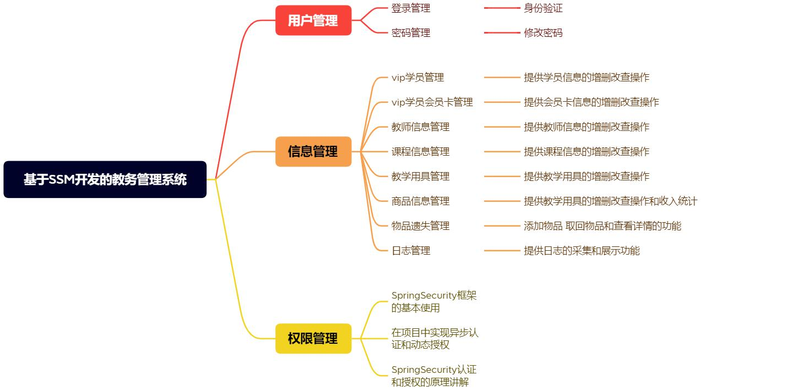

# p1--教务管理系统
基于SSMp的教务管理系统

## 1.总体介绍

### 1.1 项目总体功能介绍



### 1.2 项目环境和技术栈

- 项目环境：IDEA开发工具、MySQL数据库8.0、Maven项目构建工具、jdk1.8
- 技术栈：
  - web框架：SpringMvc、Spring、MyBatis、MyBatisPlus 
  - 数据库：MySql 
  - 项目构建工具：Maven 
  - 前端模板：Thymeleaf 
  - 安全框架：Spring security 
  - 前端框架：BootStrap,Layui 
  - 数据图表：ECharts

## 2.环境搭建

### 2.1 配置文件编写

#### 2.1.1 pom.xml

```xml
<properties>
    <project.build.sourceEncoding>UTF-8</project.build.sourceEncoding>
    <maven.compiler.source>1.8</maven.compiler.source>
    <maven.compiler.target>1.8</maven.compiler.target>
  </properties>

  <dependencies>
    <dependency>
      <groupId>org.springframework</groupId>
      <artifactId>spring-context</artifactId>
      <version>5.3.2</version>
    </dependency>

    <!--AOP面向切面编程-->
    <dependency>
      <groupId>org.springframework</groupId>
      <artifactId>spring-aspects</artifactId>
      <version>5.3.2</version>
    </dependency>

    <!--SpringMvc依赖-->
    <dependency>
      <groupId>org.springframework</groupId>
      <artifactId>spring-web</artifactId>
      <version>5.3.2</version>
    </dependency>

    <dependency>
      <groupId>org.springframework</groupId>
      <artifactId>spring-webmvc</artifactId>
      <version>5.3.2</version>
    </dependency>

    <!-- servlet依赖 -->
    <dependency>
      <groupId>javax.servlet</groupId>
      <artifactId>javax.servlet-api</artifactId>
      <version>3.1.0</version>
      <scope>provided</scope>
    </dependency>

    <!-- lombok-->
    <dependency>
      <groupId>org.projectlombok</groupId>
      <artifactId>lombok</artifactId>
      <version>1.18.12</version>
      <scope>provided</scope>
    </dependency>

    <!-- mysql驱动包 -->
    <dependency>
      <groupId>mysql</groupId>
      <artifactId>mysql-connector-java</artifactId>
      <version>8.0.25</version>
    </dependency>

    <!--Druid数据库连接池-->
    <dependency>
      <groupId>com.alibaba</groupId>
      <artifactId>druid</artifactId>
      <version>1.1.10</version>
    </dependency>

    <!-- MyBatis plus 包含了MyBatis-->
    <dependency>
      <groupId>com.baomidou</groupId>
      <artifactId>mybatis-plus</artifactId>
      <version>3.1.1</version>
    </dependency>

    <!--Spring-jdbc 整合jdbc-->
    <dependency>
      <groupId>org.springframework</groupId>
      <artifactId>spring-jdbc</artifactId>
      <version>5.3.2</version>
    </dependency>

    <!-- Spring测试模块和Junit4整合-->
    <dependency>
      <groupId>org.springframework</groupId>
      <artifactId>spring-test</artifactId>
      <version>5.3.2</version>
    </dependency>

    <dependency>
      <groupId>junit</groupId>
      <artifactId>junit</artifactId>
      <version>4.12</version>
      <scope>test</scope>
    </dependency>

    <!--面向切面编程依赖-->
    <dependency>
      <groupId>org.springframework</groupId>
      <artifactId>spring-aspects</artifactId>
      <version>5.3.2</version>
    </dependency>

    <!-- 日志工具-->
    <dependency>
      <groupId>org.slf4j</groupId>
      <artifactId>slf4j-log4j12</artifactId>
      <version>1.7.22</version>
    </dependency>

    <dependency>
      <groupId>com.google.code.gson</groupId>
      <artifactId>gson</artifactId>
      <version>2.8.5</version>
    </dependency>

    <!--SpringMvc文件上传包-->
    <dependency>
      <groupId>org.apache.commons</groupId>
      <artifactId>commons-io</artifactId>
      <version>1.3.2</version>
    </dependency>

    <dependency>
      <groupId>commons-fileupload</groupId>
      <artifactId>commons-fileupload</artifactId>
      <version>1.3.1</version>
    </dependency>

    <!-- mybatis plus 代码生成器 -->
    <dependency>
      <groupId>com.baomidou</groupId>
      <artifactId>mybatis-plus-generator</artifactId>
      <version>3.2.0</version>
    </dependency>

    <dependency>
      <groupId>org.freemarker</groupId>
      <artifactId>freemarker</artifactId>
      <version>2.3.28</version>
    </dependency>

    <!-- >springSecurity核心依赖 -->
    <dependency>
      <groupId>org.springframework.security</groupId>
      <artifactId>spring-security-config</artifactId>
      <version>5.1.5.RELEASE</version>
    </dependency>

    <dependency>
      <groupId>org.springframework.security</groupId>
      <artifactId>spring-security-taglibs</artifactId>
      <version>5.1.5.RELEASE</version>
    </dependency>

    <dependency>
      <groupId>javax.annotation</groupId>
      <artifactId>jsr250-api</artifactId>
      <version>1.0</version>
    </dependency>

    <!-- thymeleaf模板 -->
    <dependency>
      <groupId>org.thymeleaf</groupId>
      <artifactId>thymeleaf</artifactId>
      <version>3.0.9.RELEASE</version>
    </dependency>

    <dependency>
      <groupId>org.thymeleaf</groupId>
      <artifactId>thymeleaf-spring5</artifactId>
      <version>3.0.9.RELEASE</version>
    </dependency>

    <!--spring-security thymeleaf标签库-->
    <dependency>
      <groupId>org.thymeleaf.extras</groupId>
      <artifactId>thymeleaf-extras-springsecurity5</artifactId>
      <version>3.0.4.RELEASE</version>
    </dependency>
  </dependencies>
```

#### 2.1.2 db.properties

运行/数据库脚本/edu_system.sql，创建database和tables

```properties
#db.properties

jdbc.username=       #youru sername 	
jdbc.password=       #your password
jdbc.driverClassName=com.mysql.cj.jdbc.Driver   #your driver
jdbc.url=jdbc:mysql://127.0.0.1:3306/edu?useUnicode=true&characterEncoding=UTF-8&serverTimezone=Asia/Shanghai&useSSL=false&allowPublicKeyRetrieval=true   #your url

```

#### 2.1.3 log4j.properties


```properties
#log4j.properties

# log4J日志配置 根日志器
# DEBUG 日志级别  控制台
# log4j提供8种日志级别(从OFF到ALL,常用6种),日志级别从高到低:OFF>FATAL>ERROR>WARN>INFO>DEBUG>
# TRACE> ALL
# Console 控制台输出
log4j.rootLogger=DEBUG, Console
log4j.appender.Console=org.apache.log4j.ConsoleAppender
log4j.appender.Console.layout=org.apache.log4j.PatternLayout
log4j.appender.Console.layout.ConversionPattern=%d [%t] %-5p [%c] - %m%n

# SQL日志输出
log4j.logger.java.sql.ResultSet=INFO
log4j.logger.org.apache=INFO
log4j.logger.java.sql.Connection=DEBUG
log4j.logger.java.sql.Statement=DEBUG
log4j.logger.java.sql.PreparedStatement=DEBUG
```

#### 2.1.4 mybatis.xml

```xml
<?xml version="1.0" encoding="UTF-8" ?>
<!DOCTYPE configuration
        PUBLIC "-//mybatis.org//DTD Config 3.0//EN"
        "http://mybatis.org/dtd/mybatis-3-config.dtd">
<configuration>

    <typeAliases>
        <package name="com.v1.pojo"/>
    </typeAliases>

    <plugins>
        <plugin interceptor="com.baomidou.mybatisplus.extension.plugins.PaginationInterceptor"/>
    </plugins>

    <mappers>
        <package name="com.v1.mapper"/>
    </mappers>
</configuration>
```

#### 2.1.5 spring.xml

```xml
<?xml version="1.0" encoding="UTF-8"?>
<beans xmlns="http://www.springframework.org/schema/beans"
       xmlns:xsi="http://www.w3.org/2001/XMLSchema-instance"
       xmlns:context="http://www.springframework.org/schema/context"
       xmlns:tx="http://www.springframework.org/schema/tx"
       xmlns:aop="http://www.springframework.org/schema/aop"
       xsi:schemaLocation="http://www.springframework.org/schema/beans
           http://www.springframework.org/schema/beans/spring-beans.xsd
           http://www.springframework.org/schema/context
           https://www.springframework.org/schema/context/spring-context.xsd
           http://www.springframework.org/schema/tx
           http://www.springframework.org/schema/tx/spring-tx.xsd
           http://www.springframework.org/schema/aop
           https://www.springframework.org/schema/aop/spring-aop.xsd">

    <!--1.加载外部属性文件-->
    <context:property-placeholder location="classpath*:db.properties"
                                  file-encoding="UTF-8"
                                  ignore-resource-not-found="true"/>

    <!--2.数据源-->
    <bean id="ds" class="com.alibaba.druid.pool.DruidDataSource">
        <property name="driverClassName" value="${jdbc.driverClassName}"/>
        <property name="password" value="${jdbc.password}"/>
        <property name="username" value="${jdbc.username}"/>
        <property name="url" value="${jdbc.url}"/>
    </bean>

    <!--3.SqlSession工厂 MyBatis Plus使用MybatisSqlSessionFactoryBean-->
    <bean class="com.baomidou.mybatisplus.extension.spring.MybatisSqlSessionFactoryBean">
        <property name="dataSource" ref="ds"/>
        <property name="configLocation" value="classpath:mybatis.xml"/>
    </bean>

    <!--4.Mapper扫描-->
    <bean class="org.mybatis.spring.mapper.MapperScannerConfigurer">
        <property name="basePackage" value="com.v1.mapper"/>
    </bean>

    <!--5.声明式事务 事务平台管理器-->
    <bean id="transactionManager"
          class="org.springframework.jdbc.datasource.DataSourceTransactionManager">
        <property name="dataSource" ref="ds"/>
    </bean>

    <!--6.开启事务的注解支持 @Transactional-->
    <tx:annotation-driven transaction-manager="transactionManager"/>

    <!--7.包扫描-->
    <context:component-scan base-package="com.v1"/>

</beans>
```

#### 2.1.6 spring-mvc.xml

```xml
<?xml version="1.0" encoding="UTF-8"?>
<beans xmlns="http://www.springframework.org/schema/beans"
       xmlns:xsi="http://www.w3.org/2001/XMLSchema-instance"
       xmlns:context="http://www.springframework.org/schema/context"
       xmlns:mvc="http://www.springframework.org/schema/mvc"
       xsi:schemaLocation="http://www.springframework.org/schema/beans
           http://www.springframework.org/schema/beans/spring-beans.xsd
           http://www.springframework.org/schema/context
           https://www.springframework.org/schema/context/spring-context.xsd
           http://www.springframework.org/schema/mvc
           https://www.springframework.org/schema/mvc/spring-mvc.xsd
           http://www.springframework.org/schema/tx
           http://www.springframework.org/schema/tx/spring-tx.xsd
           http://www.springframework.org/schema/aop
           https://www.springframework.org/schema/aop/spring-aop.xsd">

    <!-- 扫描控制器 -->
    <context:component-scan base-package="com.v1.controller"/>

    <!-- 静态资源放行：把静态资源交给Tomcat默认的Servlet处理 -->
    <mvc:default-servlet-handler/>

    <!-- 开启注解驱动 -->
    <mvc:annotation-driven/>

    <!-- 配置文件上传视图解析器 -->
    <!-- id的值是固定的，SpringMVC程序内部使用对象名 -->
    <bean id="multipartResolver"
          class="org.springframework.web.multipart.commons.CommonsMultipartResolver">
        <!-- 设置上传文件的最大尺寸为5MB（字节为单位） -->
        <property name="maxUploadSize" value="5242880"/>
    </bean>

</beans>
```

#### 2.1.7 web.xml

```xml
<?xml version="1.0" encoding="UTF-8"?>
<web-app xmlns="http://xmlns.jcp.org/xml/ns/javaee"
         xmlns:xsi="http://www.w3.org/2001/XMLSchema-instance"
         xsi:schemaLocation="http://xmlns.jcp.org/xml/ns/javaee
         http://xmlns.jcp.org/xml/ns/javaee/web-app_4_0.xsd"
         version="4.0">

  <display-name>Archetype Created Web Application</display-name>

  <!-- Web初始化参数：指定Spring配置文件位置 -->
  <context-param>
    <param-name>contextConfigLocation</param-name>
    <param-value>classpath*:spring.xml</param-value>
  </context-param>

  <!-- Spring MVC 乱码过滤器 -->
  <filter>
    <filter-name>encodingFilter</filter-name>
    <filter-class>org.springframework.web.filter.CharacterEncodingFilter</filter-class>
    <init-param>
      <param-name>encoding</param-name>
      <param-value>UTF-8</param-value>
    </init-param>
    <!-- 强制使用指定编码 -->
    <init-param>
      <param-name>forceEncoding</param-name>
      <param-value>true</param-value>
    </init-param>
  </filter>

  <filter-mapping>
    <filter-name>encodingFilter</filter-name>
    <url-pattern>/*</url-pattern>
  </filter-mapping>

  <!-- ContextLoaderListener：监听Web项目启动事件，随之启动Spring框架 -->
  <listener>
    <listener-class>org.springframework.web.context.ContextLoaderListener</listener-class>
  </listener>

  <!-- 配置Spring MVC核心控制器 -->
  <servlet>
    <servlet-name>DispatcherServlet</servlet-name>
    <servlet-class>org.springframework.web.servlet.DispatcherServlet</servlet-class>
    <init-param>
      <param-name>contextConfigLocation</param-name>
      <param-value>classpath:spring-mvc.xml</param-value>
    </init-param>
    <load-on-startup>1</load-on-startup>
  </servlet>

  <servlet-mapping>
    <servlet-name>DispatcherServlet</servlet-name>
    <url-pattern>/</url-pattern>
  </servlet-mapping>

</web-app>
```

### 2.2 Mybatis-plus代码生成器

[mp官网]: https://baomidou.com/guides/code-generator/ "代码生成器指南"

参考[mp官网]获取详细配置。

```java
package com.v1;

import com.baomidou.mybatisplus.core.exceptions.MybatisPlusException;
import com.baomidou.mybatisplus.core.toolkit.StringPool;
import com.baomidou.mybatisplus.core.toolkit.StringUtils;
import com.baomidou.mybatisplus.generator.AutoGenerator;
import com.baomidou.mybatisplus.generator.InjectionConfig;
import com.baomidou.mybatisplus.generator.config.*;
import com.baomidou.mybatisplus.generator.config.po.TableInfo;
import com.baomidou.mybatisplus.generator.config.rules.NamingStrategy;
import com.baomidou.mybatisplus.generator.engine.FreemarkerTemplateEngine; // 修正1：类名正确拼写

import java.util.ArrayList;
import java.util.List;
import java.util.Scanner;

public class CodeGenerator {

    /**
     * <p>
     * 读取控制台内容
     * </p>
     */
    public static String scanner(String tip) {
        Scanner scanner = new Scanner(System.in);
        StringBuilder help = new StringBuilder();
        help.append("请输入" + tip + "：");
        System.out.println(help.toString());
        if (scanner.hasNext()) {
            String ipt = scanner.next();
            if (StringUtils.isNotEmpty(ipt)) {
                return ipt;
            }
        }
        throw new MybatisPlusException("请输入正确的" + tip + "！");
    }

    public static void main(String[] args) {
        // 代码生成器
        AutoGenerator mpg = new AutoGenerator();

        // 全局配置
        GlobalConfig gc = new GlobalConfig();
        String projectPath = System.getProperty("user.dir"); // 获取当前项目的路径
        // 注意：如果路径包含中文或空格，建议使用项目根路径
        gc.setOutputDir(projectPath + "/src/main/java"); // 真正生成的路径
        gc.setAuthor("v1"); // 作者信息
        gc.setOpen(false); // 不用打开代码生成的文件夹窗口
//        gc.setSwagger2(true); // 可选：开启Swagger2注解支持
        // gc.setFileOverride(true); // 可选：覆盖已有文件
        gc.setServiceName("%sService"); // 设置Service接口名称，去掉I前缀
        mpg.setGlobalConfig(gc);

        // 数据源配置
        DataSourceConfig dsc = new DataSourceConfig();
        dsc.setUrl("jdbc:mysql://localhost:3306/edu?useUnicode=true&useSSL=false&characterEncoding=utf8&serverTimezone=Asia/Shanghai");
        dsc.setDriverName("com.mysql.cj.jdbc.Driver");
        dsc.setUsername("root");
        dsc.setPassword("123456");
        mpg.setDataSource(dsc);

        // 包配置
        PackageConfig pc = new PackageConfig();
        pc.setParent("com.v1");
        pc.setEntity("pojo");
        pc.setMapper("mapper");
        pc.setService("service");
        pc.setServiceImpl("service.impl");
        pc.setController("controller"); // 建议添加controller包配置
        mpg.setPackageInfo(pc);

        // 模板配置
        TemplateConfig templateConfig = new TemplateConfig();
        templateConfig.setXml(null); // 不生成XML文件
        // templateConfig.setController("/templates/controller.java"); // 自定义controller模板
        mpg.setTemplate(templateConfig);

        // 策略配置
        StrategyConfig strategy = new StrategyConfig();
        strategy.setNaming(NamingStrategy.underline_to_camel); // 开启驼峰命名
        strategy.setColumnNaming(NamingStrategy.underline_to_camel);

        strategy.setInclude(scanner("表名，多个英文逗号分割").split(","));
        strategy.setControllerMappingHyphenStyle(true); // Controller映射使用连字符
        strategy.setEntityLombokModel(true); // 使用Lombok注解
        strategy.setRestControllerStyle(true); // 生成@RestController注解
        mpg.setStrategy(strategy);

        // 设置模板引擎
        mpg.setTemplateEngine(new FreemarkerTemplateEngine()); // 修正2：类名正确拼写

        // 执行生成
        mpg.execute();
    }
}
```

### 2.3 Thymeleaf模板

在spring-mvc.xml中添加如下配置：

```xml
 <!-- 模板引擎解析器 -->
    <bean id="templateResolver"
          class="org.thymeleaf.spring5.templateresolver.SpringResourceTemplateResolver">
        <property name="prefix" value="/WEB-INF/templates/"/>
        <property name="suffix" value=".html"/>
        <!-- 模板引擎使用严格的HTML语法 -->
        <property name="templateMode" value="HTML"/>
        <!-- 模板引擎要不要缓存（开发时设为false，生产环境设为true） -->
        <property name="cacheable" value="false"/>
        <property name="characterEncoding" value="UTF-8"/>
    </bean>

    <!-- 模板引擎 -->
    <bean id="templateEngine"
          class="org.thymeleaf.spring5.SpringTemplateEngine">
        <property name="templateResolver" ref="templateResolver"/>
        <!-- 配置Thymeleaf标签库 -->
        <property name="additionalDialects">
            <set>
                <bean class="org.thymeleaf.extras.springsecurity5.dialect.SpringSecurityDialect"/>
            </set>
        </property>
    </bean>

    <!-- Thymeleaf模板引擎整合到Spring环境中 -->
    <bean class="org.thymeleaf.spring5.view.ThymeleafViewResolver">
        <property name="templateEngine" ref="templateEngine"/>
        <!-- 中文乱码问题 -->
        <property name="characterEncoding" value="UTF-8"/>
        <!-- 设置响应内容类型 -->
        <property name="contentType" value="text/html; charset=UTF-8"/>
        <!-- 视图名称顺序（可选） -->
        <property name="order" value="1"/>
    </bean>
```

测试Thymeleaf是否可用：

```java
    @RequestMapping("/testThymeleaf")
    public String testThymeleaf(Model model){
        model.addAttribute("userName","eric");
        return "hello";
    }
```

```html
<!DOCTYPE html>
<html lang="en" xmlns:th="http://www.thymeleaf.org">
<head>
    <meta charset="UTF-8">
    <title>Title</title>
</head>
<body>
    <h5>hello Thymeleaf</h5>
    <p th:text="${userName}"></p>
</body>
</html>
```

重启tomcat，发送请求，查看页面是否渲染数据

http://localhost:8888/membertype/testThymeleaf

## 3. 会员卡功能模块实现

### 3.1 分页查询-会员卡类型

需求：打开会员卡页面member-type.html，展示会员卡数据；进行会员卡名称进行 条件查询，也能分页展示会员卡数据。

#### 3.1.1 前端分析

- 页面打开时，发送分页请求

```js
 $(function () {
            //页面加载的时候发送异步分页请求
            $('#table').bootstrapTable({
                url: '/membertype/queryPage',  //请求地址
                method: 'get',
                contentType: "application/x-www-form-urlencoded",
                columns: [
                    {field: 'typeId', title: '会员卡编号', sortable: true},
                    {field: 'typeName', title: '会员卡名称', sortable: true},
                    {field: 'typeDay', title: '有效天数', sortable: true},
                    {field: 'typeciShu', title: '有效次数', sortable: true},
                    {field: 'typemoney', title: '售价', sortable: true},
                    {
                        field: 'xx', title: '操作',
                        formatter: function (value, row, index) {
                            return "<a href='javascript:del1(" + row.typeId + ")' class='glyphicon glyphicon-trash'>&nbsp;&nbsp;</a><a href='javascript:upd1(" + row.typeId + ")' class='glyphicon glyphicon-pencil'></a>";
                        }
                    }
                ],
                queryParamsType: '',
                queryParams: queryParams,
                height: 360,
                pageList: [5, 10, 15],
                pageNumber: 1,  //当前页码
                pageSize: 5,    //每页大小
                pagination: true,
                sidePagination: 'server',
            })
        });
```

- 点击查询按钮发送分页请求

```js
 $.getJSON("/membertype/queryPage", {
                "pageSize": opt.pageSize,
                "pageNumber": opt.pageNumber,
                "typeName": typeName
            }, function (releset) {
                $("#table").bootstrapTable('load', releset);
            })
```

#### 3.1.2 后端分析

- 接口传入的参数类型：

  | 字段       | 含义     |
  | ---------- | -------- |
  | typeName   | 查询类型 |
  | pageNumber | 当前页数 |
  | pageSize   | 分页大小 |

- 当前接口需要返回给前端的参数：

  | 字段  | 含义             |
  | ----- | :--------------- |
  | total | 总记录数         |
  | rows  | 当前页面数据列表 |

1. 定义map数据类型，存储total，rows
2. QueryWrapper构建查询条件后调用memberType的page方法获取分页结果
3. 提取出total和rows放入map并返回

```java
@RequestMapping("queryPage")
    @ResponseBody
    public Map<String,Object> queryPage(String typeName, Integer pageNumber, Integer pageSize){
        Map<String,Object> resultMap = new HashMap<>();
        log.info("typeName:" + typeName);
        log.info("pageSize:" + pageSize);
        log.info("pageNumber:" + pageNumber);
        //select * from membertype where typeName like "%typeName%"
        QueryWrapper<Membertype> q = new QueryWrapper<>();
        q.like(typeName != null &&  !"".equals(typeName),"typeName",typeName);
        q.eq("typeDel",0);//查询没有逻辑删除的数据
        IPage<Membertype> iPage = membertypeService.page(new Page<Membertype>(pageNumber, pageSize), q);
        resultMap.put("total",iPage.getTotal());
        resultMap.put("rows", iPage.getRecords());
        return resultMap;
    }
```

### 3.2  新增-会员卡信息

需求：点击添加会员卡按钮，完成会员卡信息的添加。

#### 3.2.1 前端分析

```js
$.post('/membertype/add', {
                'typeName': name,
                'typeciShu': cishu,
                'typeDay': tianshu,
                'typemoney': money
            }, function (data) {
                console.log("返回值:" + JSON.stringify(data));
                if (data.code == 200) {
                    //新增成功之后渲染数据重写查询
                    $("#table").bootstrapTable("load", data);
                    $.getJSON("/membertype/queryPage", {
                        "pageSize": opt.pageSize,
                        "pageNumber": opt.pageNumber,
                        "typeName": typeId
                    }, function (releset) {
                        $("#table").bootstrapTable('load', releset);
                    });
                    swal("添加！", "添加成功", "success");
                } else {
                    console.log("添加失败:" + JSON.stringify(data));
                    swal("添加！", "添加失败", "error");
                }
            });
```

#### 3.2.2 后端分析

接口传入参数类型：memberType

接口返回参数：DataResults，成功返回ResultCode.SUCCESS，失败返回ResultCode.FAIL

```java
    @RequestMapping("/add")
    @ResponseBody
    public DataResults add(Membertype membertype){
        log.info("新增数据是："+membertype);
        membertype.setTypeDel(0);	//将是否逻辑删除设置为0，即 未删除
        boolean save = membertypeService.save(membertype);
        if(save){
            return DataResults.success(ResultCode.SUCCESS);
        }else{
            return DataResults.success(ResultCode.FAIL);
        }
    }
```

### 3.3 回显-会员卡数据

#### 3.3.1 前端分析

```js
 //查询一个对象数据回显
            $.getJSON('/membertype/queryById/' + id, function (result) {
                if (result.code == 200) {
                    var data = result.data;
                    $("#table").bootstrapTable("load", data);
                    $("#xgname").val(data.typeName);
                    $("#xgtianshu").val(data.typeDay);
                    $("#xgcishu").val(data.typeciShu);
                    $("#xgmoney").val(data.typemoney);
                } else {
                    swal("温馨提示！", "服务器异常", "error");
                }
            });
```

#### 3.3.2 后端分析

接口传入参数：param1 typeId

```java
    @RequestMapping("/queryById/{typeId}")
    @GetMapping
    public DataResults queryById(@PathVariable("typeId") Integer typeId){
        Membertype membertype = membertypeService.getById(typeId);
        if(membertype != null){
            return DataResults.success(ResultCode.SUCCESS,membertype);
        }else{
            return DataResults.success(ResultCode.FAIL,null);
        }
    }
```

### 3.4 编辑-会员卡数据

#### 3.4.1 前端分析

```js
 $.ajax({
                url: "/membertype/update",
                type: "post",
                data: {
                    'typeId': id,
                    'typeName': name,
                    'typeciShu': cishu,
                    'typeDay': tianshu,
                    'typemoney': money,
                    '_method': 'put'
                },
                success: function (result) {
                    if (result.code == 200) {
                        $("#table").bootstrapTable("load", result);
                        $.getJSON("/membertype/queryPage", {
                            "pageSize": opt.pageSize,
                            "pageNumber": opt.pageNumber,
                            "typeName": typeId
                        }, function (releset) {
                            $("#table").bootstrapTable('load', releset);
                        });
                        swal("更新！", "更新成功", "success");
                    } else {
                        swal("更新！", "更新失败", "error");
                    }
                }
            });
```

#### 3.4.2 后端分析

接口传入参数：param1 membertype

```java
    @RequestMapping("/update")
    @ResponseBody
    public DataResults update(Membertype membertype){
        log.info("更新之后的数据是："+membertype);
        boolean update = membertypeService.updateById(membertype);
        if(update){
            return DataResults.success(ResultCode.SUCCESS);
        }else{
            return DataResults.fail(ResultCode.FAIL);
        }
    }
```

### 3.5 删除-会员卡数据

#### 3.5.1 前端分析

```js
 //删除
        function del1(id) {
            swal({
                    title: "确定删除吗？",
                    text: "您将无法恢复！",
                    type: "warning",
                    showCancelButton: true,
                    confirmButtonColor: "#DD6B55",
                    confirmButtonText: "确定删除！",
                    cancelButtonText: "取消删除！",
                    closeOnConfirm: false,
                    closeOnCancel: false
                },
                function (isConfirm) {
                    if (isConfirm) {
                        var opt = $('#table').bootstrapTable('getOptions');
                        var typeId = $('#cardid').val();
                        $.post('/membertype/delete/'+id, {
                            '_method':'delete'
                        }, function (result) {
                            if (result.code == 200) {
                                $("#table").bootstrapTable("load", result);
                                $.getJSON("/membertype/queryPage", {
                                    "pageSize": opt.pageSize,
                                    "pageNumber": opt.pageNumber,
                                    "typeName": typeId
                                }, function (releset) {
                                    $("#table").bootstrapTable('load', releset);
                                });
                                swal("删除！", "删除成功", "success");
                            } else {
                                swal("删除！", "删除失败", "error");
                            }
                        });
                    } else {
                        swal("取消！", "您已取消删除)", "error");
                    }
                });
```

#### 3.5.2 后端分析

接口传入参数：param1 typeId

```java
    @RequestMapping("delete/{typeId}")
    @ResponseBody
    public DataResults delete(@PathVariable Integer typeId){
        //逻辑删除
        Membertype membertype = new Membertype(typeId, 1);
        boolean update = membertypeService.updateById(membertype);
        if(update){
            return DataResults.success(ResultCode.SUCCESS);
        }else{
            return DataResults.fail(ResultCode.FAIL);
        }
    }
```


## 4. 教学器材模块功能实现

### 4.1 分页查询-教学器材

#### 4.1.1 前端分析

```js
$('#table').bootstrapTable({
                url: '/equipment/queryPage',
                columns: [
                    {
                        field: 'eqId',
                        title: '编号'
                    }, {
                        field: 'eqName',
                        title: '器材名称'
                    }, {
                        field: 'eqText',
                        title: '器材说明'
                    },
                    {
                        field: 'xx', title: '操作',
                        formatter: function (value, row, index) {
                            return "<a title='删除' href='javascript:del("
                                + row.eqId + ")'><span class='glyphicon glyphicon-trash'></span></a>";
                        }
                    }
                ],
                method: 'get',
                contentType: "application/x-www-form-urlencoded",
                queryParamsType: '',
                queryParams: queryParams,
                height: 360,
                pageList: [5, 10, 15],
                pageNumber: 1,
                pageSize: 5,
                pagination: true,
                sidePagination: 'server',
            });
```

#### 4.1.2 后端分析

```java
    @GetMapping("/queryPage")
    public Map<String,Object> queryPage(String eqName, Integer pageNumber, Integer pageSize){
        Map<String,Object> res = new HashMap<>();
        QueryWrapper<Equipment> q = new QueryWrapper<>();
        q.like(eqName != null && !eqName.equals(""),"eqName",eqName);
        q.eq("del",0);//逻辑删除的数据不查询
        IPage<Equipment> page = equipmentService.page(new Page<Equipment>(pageNumber, pageSize), q);
        res.put("total",page.getTotal());
        res.put("rows",page.getRecords());
        return res;
    }
```

### 4.2 新增-教学器材

#### 4.2.1 前端分析

```js
$.post("/equipment/add", {"eqName": name, "eqText": text1}, function (releset) {
                alert(JSON.stringify(releset)); // {"code":403,"msg":"暂无权限操作"}
                if (releset.code == 200) {
                    $("#table").bootstrapTable('load', releset);
                    $('#exampleModal').modal('hide');
                    //新增成功之后渲染数据重写查询
                    swal("添加！", "添加成功", "success");
                    chaxun();
                } else if (releset.code == 403) {
                    swal("添加！", "添加没有权限", "error");
                } else {
                    swal("添加！", "添加失败", "error");
                }
            }, "json");
```

#### 4.2.2  后端分析

```java
@PostMapping("/add")
    public DataResults add(Equipment equipment){
        equipment.setDel(0);
        boolean saved = equipmentService.save(equipment);
        if(saved){
            return DataResults.success(ResultCode.SUCCESS);
        }else{
            return DataResults.success(ResultCode.FAIL);
        }
    }
```

### 4. 删除-教学器材

#### 4.3.1 前端分析

```js
 $.post("/equipment/delete/" + eqId, {"_method": "delete"}, function (releset) {
                if (releset.code == 200) {
                    $("#dg").bootstrapTable('load', releset);
                    swal(
                        {
                            title: "删除成功",
                            type: "success",
                            timer: 1500,
                            showConfirmButton: false
                        }
                    );
                    search();
                } else {
                    swal(
                        {
                            title: "删除失败",
                            type: "warning",
                            timer: 1500,
                            showConfirmButton: false
                        }
                    )
                }
            })
```

#### 4.3.2 后端分析

```java
    @DeleteMapping("/delete/{eqId}")
    public DataResults delete(@PathVariable("eqId") Integer eqId) {
        Equipment equipment = new Equipment(eqId, 1);
        boolean updated = equipmentService.updateById(equipment);
        if(updated){
            return DataResults.success(ResultCode.SUCCESS);
        } else {
            return DataResults.success(ResultCode.FAIL);
        }
    }
```

### 4.4 回显-教学器材

#### 4.4.1 前端分析 

```js
$.getJSON('/equipment/queryById/' + id, function (result) {
                if (result.code == 200) {
                    var data = result.data;
                    $("#table").bootstrapTable("load", data);
                    $("#xgname").val(data.eqName);
                    $("#xgtext").val(data.eqText);
                } else {
                    swal("温馨提示！", "服务器异常", "error");
                }
            });
```

#### 4.4.2 后端分析

```java
    @RequestMapping("/queryById/{typeId}")
    @GetMapping
    public DataResults queryById(@PathVariable("typeId") Integer typeId){
        Equipment equipment = equipmentService.getById(typeId);
        if(equipment != null){
            return DataResults.success(ResultCode.SUCCESS,equipment);
        }else{
            return DataResults.success(ResultCode.FAIL,null);
        }
    }
```

### 4.5 更新-教学器材

#### 4.5.1 前端分析

```js
$.ajax({
                url: "/equipment/update",
                type: "post",
                data: {
                    'eqId': id,
                    'eqName': name,
                    'eqText': text1,
                    '_method': 'put'
                },
                success: function (result) {
                    if (result.code == 200) {
                        $("#table").bootstrapTable("load", result);
                        $.getJSON("/equipment/queryPage", {
                            "pageSize": opt.pageSize,
                            "pageNumber": opt.pageNumber,
                            "eqName": $('#eqname').val()
                        }, function (releset) {
                            $("#table").bootstrapTable('load', releset);
                        });
                        swal("更新！", "更新成功", "success");
                    } else {
                        swal("更新！", "更新失败", "error");
                    }
                }
            });
```

#### 4.5.2 后端分析

```java
    @RequestMapping("/update")
    @PutMapping
    public DataResults update(Equipment equipment){
        log.info("更新之后的数据是："+equipment);
        boolean update = equipmentService.updateById(equipment);
        if(update){
            return DataResults.success(ResultCode.SUCCESS);
        }else{
            return DataResults.fail(ResultCode.FAIL);
        }
    }
```

## 5. 课程模块功能实现

### 5.1 分页查询-课程信息

#### 5.1.1 前端分析

```js
$('#table').bootstrapTable({
                url: '/subject/queryPage',
                method: 'get',
                contentType: "application/x-www-form-urlencoded",
                columns: [
                    {field: 'subId', title: '课程编号', sortable: true},
                    {field: 'subname', title: '课程名称', sortable: true},
                    {field: 'sellingPrice', title: '课程售价', sortable: true},
                    {
                        field: 'xx', title: '操作',
                        formatter: function (value, row, index) {
                            return "<a title='删除' href='javascript:del1("
                                + row.subId + ")'><span class='glyphicon glyphicon-trash'></span></a> | <a href='javascript:upd1(" + row.subId + ")' class='glyphicon glyphicon-pencil'></a>";
                        }

                    }
                ],
                queryParamsType: '',
                queryParams: queryParams,
                height: 360,
                pageList: [5, 10, 15],
                pageNumber: 1,
                pageSize: 5,
                pagination: true,
                sidePagination: 'server',

            })
        });
```

#### 5.1.2后端分析

```java
    @GetMapping("/queryPage")
    public Map<String, Object> queryPage(String subname, Integer pageSize, Integer pageNumber) {
        Map<String, Object> res = new HashMap<>();
        QueryWrapper<Subject> queryWrapper = new QueryWrapper<Subject>().like(subname != null && !subname.equals(""), "subname", subname);
        queryWrapper.eq("del",0);
        IPage<Subject> page = subjectService.page(new Page<Subject>(pageNumber, pageSize), queryWrapper);
        res.put("total",page.getTotal());
        res.put("rows",page.getRecords());
        return res;
    }
```

### 5.2 新增-课程信息

#### 5.2.1 前端分析

1. 新增课程是否已经操作(根据课程名称)
2. 如果不存在则新增数据

```js
$.getJSON("/subject/subnameExist", {"subname": name}, function (releset) {
                $("#table").bootstrapTable('load', releset.data);
                if (releset.data < 1) { // releset.data 记录在数据库查询数据的记录条数
                    $.post('/subject/add', {
                        'subname': name,
                        'sellingPrice': money
                    }, function (data) {
                        $("#table").bootstrapTable("load", data);
                        $.getJSON("/subject/queryPage", {
                            "pageSize": opt.pageSize,
                            "pageNumber": opt.pageNumber,
                            "subname": subjectid
                        }, function (releset) {
                            $("#table").bootstrapTable('load', releset.data);
                        });
                        swal("添加！", "添加成功",
                            "success");
                        search();
                    });
                } else if (releset.data > 0) {
                    swal("失败！", "已有该课程，请重新输入！", "error");
                    $.getJSON("/subject/queryPage", {
                        "pageSize": opt.pageSize,
                        "pageNumber": opt.pageNumber,
                        "subname": subjectid
                    }, function (releset) {
                        $("#table").bootstrapTable('load', releset.data);
                    })
                }
            })
```

#### 5.2.2 后端分析

```java
    @GetMapping("/subnameExist")
    public DataResults subNameExist(String subname){
        //select count(*) from subject where subname = ? and del = ?
        int count = subjectService.count(new QueryWrapper<Subject>().eq("subname", subname).eq("del", 0));
        return DataResults.success(ResultCode.SUCCESS,count);
    }

    @PostMapping("/add")
    public DataResults add(Subject subject){
        log.info("要新增的数据是："+subject);
        subject.setDel(0);
        boolean saved = subjectService.save(subject);
        if(saved){
            return DataResults.success(ResultCode.SUCCESS);
        }else{
            return DataResults.success(ResultCode.FAIL);
        }
    }
```

### 5.3 删除-课程信息

#### 5.3.1 前端分析

```js
$.post('/subject/delete/'+id, {
                            "_method": 'delete'
                        }, function (result) {
                            if (result.code == 200) {
                                $.getJSON("/subject/queryPage", {
                                    "pageSize": opt.pageSize,
                                    "pageNumber": opt.pageNumber,
                                    "subname": subjectid
                                }, function (releset) {
                                    $("#table").bootstrapTable('load', releset);
                                });
                                swal("删除！", "删除成功", "success");
                            } else {
                                swal("删除！", "删除失败", "error");
                            }
                        });
```

#### 5.3.2  后端分析

```java
    @DeleteMapping("/delete/{id}")
    public DataResults delete(@PathVariable("id") Integer id){
        Subject subject = new Subject(id,1);
        boolean updated = subjectService.updateById(subject);
        if(updated){
            return DataResults.success(ResultCode.SUCCESS);
        }else{
            return DataResults.success(ResultCode.FAIL);
        }
    }
```

### 5.4 回显-课程信息

#### 5.4.1前端分析

```js
$.getJSON('/subject/queryById/' + id, function (result) {
                $("#table").bootstrapTable("load", result);
                $("#xgname").val(result.data.subname);
                $("#xgmoney").val(result.data.sellingPrice);
            });
```

#### 5.4.2 后端分析

```java
    @GetMapping("/queryById/{id}")
    public DataResults queryById(@PathVariable("id") Integer id){
        Subject subject = subjectService.getById(id);
        if(subject != null){
            return DataResults.success(ResultCode.SUCCESS,subject);
        }else{
            return DataResults.success(ResultCode.FAIL,null);
        }
    }
```

### 5.5 更新-课程信息

#### 5.5.1 前端分析

```js
$.post('/subject/update', {
                'subId': id,
                'subname': name,
                'sellingPrice': money,
                '_method': 'put'
            }, function (result) {
                if (result.code == 200) {
                    //$("#table").bootstrapTable("load", result);
                    $.getJSON("/subject/queryPage", {
                        "pageSize": opt.pageSize,
                        "pageNumber": opt.pageNumber,
                        "subname": subjectid
                    }, function (releset) {
                        $("#table").bootstrapTable('load', releset);
                    });
                    swal("更新！", "更新成功", "success");
                } else {
                    swal("更新！", "更新失败", "error");
                }
            });
```

#### 5.5.2 后端分析

```java
    @PutMapping("/update")
    public DataResults update(Subject subject){
        boolean updated = subjectService.updateById(subject);
        if(updated){
            return DataResults.success(ResultCode.SUCCESS);
        }else{
            return DataResults.fail(ResultCode.FAIL);
        }
    }
```

## 6. vip学员管理功能模块

### 6.1 分页查询-vip学员信息

#### 6.1.1 前端分析

```js
$.getJSON("/member/queryPage",{"pageSize":opt.pageSize,"pageNumber":1,"hyname":hyid,"ktype":ktype},function (releset) {
                $("#dg").bootstrapTable('load',releset) ;
            })
```

#### 6.1.2 后端分析

卡类型属于member-type表，其他信息属于member表。

查询学员信息需要根据typeId进行联表查询

控制器方法：

```java
 @GetMapping("queryPage")
    public Map<String,Object> queryPage(String hyname, Integer ktype, Integer pageSize, Integer pageNumber){
        Map<String,Object> resMap = new HashMap<>();
        Map<String,Object> paramMap = new HashMap<>();
        paramMap.put("hyname",hyname);
        paramMap.put("ktype",ktype);
        if(pageSize == null){
            pageSize = 10;
        }
        if(pageNumber == null){
            pageNumber = 1;
        }
        paramMap.put("pageStart",(pageNumber - 1) * pageSize);
        paramMap.put("pageSize",pageSize);

        int totalCount = memberService.totalCount(paramMap);
        List<Member> list = memberService.pageMembers(paramMap);
        resMap.put("total",totalCount);
        resMap.put("rows",list);
        return resMap;
    }
```

声明映射关系：

```xml
    <resultMap id="memberMap" type="member">
        <id column="memberId" property="memberId"></id>
        <result column="memberName" property="memberName"></result>
        <result column="memberPhone" property="memberPhone"></result>
        <result column="memberSex" property="memberSex"></result>
        <result column="memberAge" property="memberAge"></result>
        <result column="memberTypes" property="memberTypes"></result>
        <result column="nenberDate" property="nenberDate"></result>
        <result column="birthday" property="birthday"></result>
        <result column="memberStatic" property="memberStatic"></result>
        <result column="memberbalance" property="memberbalance"></result>
        <result column="memberxufei" property="memberxufei"></result>
        <association property="membertype" javaType="membertype">
            <id column="typeId" property="typeId"></id>
            <result column="typeName" property="typeName"></result>
            <result column="typeciShu" property="typeciShu"></result>
            <result column="typeDay" property="typeDay"></result>
            <result column="typemoney" property="typemoney"></result>
        </association>
    </resultMap>
```

持久层方法：

```java
public interface MemberMapper extends BaseMapper<Member> {

    List<Member> pageMembers(Map<String, Object> paramMap);

    int totalCount(Map<String, Object> paramMap);
}
```

```xml
    <!--    List<Member> pageMembers(Map<String, Object> paramMap);-->
    <select id="pageMembers" resultMap="memberMap">
        select * from member inner join membertype on member.memberTypes = memberType.typeId
        where member.del = 0 and membertype.typeDel = 0
        <if test="hyname != null and hyname !='' ">
            and memberName like '%${hyname}%'
        </if>

        <if test="ktype != null and ktype !=0">
            and memberTypes = #{ktype}
        </if>
        limit #{pageStart},#{pageSize}
    </select>

    <!--    int totalCount(Map<String, Object> paramMap);-->
    <select id="totalCount" resultType="int">
        select count(*) from member inner join membertype on member.memberTypes = memberType.typeId
        where member.del = 0 and membertype.typeDel = 0
        <if test="hyname != null and hyname !='' ">
            and memberName like '%${hyname}%'
        </if>

        <if test="ktype != null and ktype !=0">
            and memberTypes = #{ktype}
        </if>
    </select>
```

### 6.2  新增-学员信息

#### 6.2.1 前端分析

新增的学员要根据会员卡类型获取到期的时间

```js
//根据会员卡类型查询会员卡天数
            $.getJSON("/membertype/getDays/"+optype,{},function (releset) {

                //会员卡对应的天数
                var typetian=releset.data.typeDay;
                var date1 = new Date();

                var date2 = new Date(date1);
                //续费时间
                date2.setDate(date1.getDate() + typetian);
                //格式化续费时间
                var rq=date2.getFullYear() + "-" + (date2.getMonth() + 1) + "-" + date2.getDate();
                $.post("/member/add",{"memberName":name,"memberPhone":phone,"memberSex":sex,"birthday":srdata,"memberTypes":optype,"nenberDate":data,"memberAge":age,"memberxufei":rq},function (releset) {
                    if(releset.code == 200){
                        $("#dg").bootstrapTable('load',releset) ;
                        $('#exampleModal').modal('hide');
                        swal(
                            {
                                title:"添加成功",
                                type:"success",
                                timer: 1500,
                                showConfirmButton: false
                            }
                        );
                        //查询
                        search();
                    }else{
                        swal(
                            {
                                title:"添加失败",
                                type:"warning",
                                timer: 1500,
                                showConfirmButton: false
                            }
                        )
                    }
                })
            })
```

#### 6.2.2后端分析

1. 根据typeId获取到memebr-type，前端会计算到期时间
2. 添加学员信息 

```java
    @GetMapping("/getDays/{typeId}")
    public DataResults getDays(@PathVariable("typeId") Integer typeId){
        Membertype membertype = membertypeService.getById(typeId);
        return DataResults.success(ResultCode.SUCCESS,membertype);
    }
```

```java
    @PostMapping("/add")
    public DataResults add(Member member){
        member.setMemberbalance(0.0F);
        member.setMemberStatic(1);
        member.setDel(0);
        boolean saved = memberService.save(member);
        if(saved){
            return DataResults.success(ResultCode.SUCCESS);
        }else{
            return DataResults.success(ResultCode.FAIL);
        }
    }
```

### 6.3 更新-vip学员信息

#### 6.3.1 前端分析

学员信息更改后，如果学员信息发生更改，到期时间也要随之更改

```js
$.getJSON("/membertype/getDays/"+optype,{},function (releset) {
                var typetian=releset.data.typeDay;
                //alert("开卡日期:"+data);
                var date1 = new Date(data); //开卡日期

                //alert("开卡日期:"+date1);
                var date2 = new Date(date1);
                var qb=date2.setDate(date1.getDate() + typetian);
                var rq=date2.getFullYear() + "-" + (date2.getMonth() + 1) + "-" + date2.getDate();
                $.post("/member/update",{"_method":"put","memberId":id,"memberName":name,"memberPhone":phone,"memberSex":sex,"birthday":srdata,"memberTypes":optype,"nenberDate":data,"memberAge":age,"memberxufei":rq},function (releset) {
                    $("#dg").bootstrapTable('load',releset) ;
                    if(releset.code==200){
                        $("#dg").bootstrapTable('load',releset) ;
                        $('#updateeModal').modal('hide');
                        swal(
                            {
                                title:"修改成功",
                                type:"success",
                                timer: 1500,
                                showConfirmButton: false
                            }
                        );
                        //查询
                        search();
                    }else{
                        swal(
                            {
                                title:"修改失败",
                                type:"warning",
                                timer: 1500,
                                showConfirmButton: false
                            }
                        )
                    }
                })
            })
```

#### 6.3.2 后端分析

1. 根据typeId获取到memebr-type，前端会计算到期时间
2. 添加学员信息 

```java
    @PutMapping("update")
    public DataResults update(Member member){
        member.setDel(0);
        boolean updated = memberService.updateById(member);
        if(updated){
            return DataResults.success(ResultCode.SUCCESS);
        }else{
            return DataResults.success(ResultCode.FAIL);
        }
    }
```

### 6.3 回显-vip学员信息

#### 6.3.1 前端分析

```js
$.getJSON('/member/queryById/' + memberId, function (result) {
                if (result.code == 200) {
                    var data = result.data;
                    //alert(JSON.stringify(data));
                    $('#updateeModal').modal('show');
                    $.getJSON("/membertype/list",{},function (releset) {
                        var e=releset.data;
                        var tt ="";
                        var tttt="";
                        var ttt="<option value='-1'>"+"--请选择--"+"</option>";
                        $(e).each(function () {
                            tt += "<option value='"+this.typeId+"'>"+""+this.typeName+"</option>";
                            tttt=ttt+tt;
                        });
                        $('#upoptype').html(tttt);
                        //回显下拉框
                        $('#upoptype').val(data.memberTypes);
                    }),

                    $('#upname').val(data.memberName);
                    $('#upphone').val(data.memberPhone);
                    $('#upsex').val(data.memberSex);
                    $('#upsrdata').val(data.birthday);
                    $('#updata').val(data.nenberDate);
                    $('#upage').val(data.memberAge);
                    $('#upid').val(data.memberId);

                } else {
                    swal("温馨提示！", "服务器异常", "error");
                }
            });
```

6.3.2 后端分析

```java
    @GetMapping("queryById/{memberId}")
    public DataResults queryById(@PathVariable("memberId") Integer memberId){
        Member member = memberService.getById(memberId);
        Integer types = member.getMemberTypes();
        Membertype membertype = membertypeService.getById(types);
        member.setMembertype(membertype);
        return DataResults.success(ResultCode.SUCCESS,member);
    }
```

### 6.4 vip学员会员到期模块

```java
    @GetMapping("queryPageExpire")
    public Map<String,Object> queryPageExpire(String hyname, Integer ktype, Integer pageSize, Integer pageNumber){
        Map<String, Object> resultMap = new HashMap<>();
        Map<String, Object> paramMap = new HashMap<>();

        paramMap.put("hyname",hyname);
        paramMap.put("ktype",ktype);
        if(pageSize == null){
            pageSize = 10;
        }
        if(pageNumber == null){
            pageNumber = 1;
        }
        paramMap.put("pageStart",(pageNumber - 1) * pageSize);
        paramMap.put("pageSize",pageSize);
        paramMap.put("nowTime", DateTimeUtils.nowTime());

        int totalCount = memberService.totalCount(paramMap);
        List<Member> list = memberService.pageMembers(paramMap);
        resultMap.put("total",totalCount);
        resultMap.put("rows",list);
        return resultMap;
    }
```

```xml
    <select id="pageMembers" resultMap="memberMap">
        select * from member inner join membertype on member.memberTypes = memberType.typeId
        where member.del = 0 and membertype.typeDel = 0
        <if test="hyname != null and hyname !='' ">
            and memberName like '%${hyname}%'
        </if>

        <if test="ktype != null and ktype !=0">
            and memberTypes = #{ktype}
        </if>
        <if test="nowTime != null and nowTime != ''">
            and memberxufei &lt; #{nowTime}
        </if>
        limit #{pageStart},#{pageSize}
    </select>

    <!--    int totalCount(Map<String, Object> paramMap);-->
    <select id="totalCount" resultType="int">
        select count(*) from member inner join membertype on member.memberTypes = memberType.typeId
        where member.del = 0 and membertype.typeDel = 0
        <if test="hyname != null and hyname !='' ">
            and memberName like '%${hyname}%'
        </if>

        <if test="ktype != null and ktype !=0">
            and memberTypes = #{ktype}
        </if>
        <if test="nowTime != null and nowTime != ''">
            and memberxufei &lt; #{nowTime}
        </if>
```

## 7. 续费管理模块

### 7.1 分页查询-续费列表

#### 7.1.1 前端分析

```js
$.getJSON("/member-charge/queryPageCharge",{"pageSize":opt.pageSize,"pageNumber":opt.pageNumber,"hyname":hyid,"ktype":ktype},function (releset) {
                $("#dg").bootstrapTable('load',releset) ;
            })
```

#### 7.1.2 后端分析

```java
    @GetMapping("queryPageCharge")
    public Map<String,Object> queryPageCharge(String hyname, Integer ktype, Integer pageNumber, Integer pageSize){
        Map<String, Object> resultMap = new HashMap<>();
        Map<String,Object> paramMap = new HashMap<>();

        paramMap.put("hyname",hyname);
        paramMap.put("ktype",ktype);
        if(pageSize == null){
            pageSize = 10;
        }
        if(pageNumber == null){
            pageNumber = 1;
        }
        paramMap.put("pageStart",(pageNumber - 1) * pageSize);
        paramMap.put("pageSize",pageSize);

        int totalCount = memberService.totalCount(paramMap);
        List<Member> list = memberService.pageMembers(paramMap);
        resultMap.put("total",totalCount);
        resultMap.put("rows",list);
        return resultMap;
    }
```

### 7.2 vip续费功能

#### 7.2.1 前端分析

```js
$.post("/member-charge/charge",{"remark":bz,"memberId":id,"money":jine},function (releset) {
                if(releset.code == 200){
                    $("#dg").bootstrapTable('load',releset) ;
                    //关闭
                    $('#updateeModal').modal('hide');
                    swal(
                        {
                            title:"充值成功",
                            type:"success",
                            timer: 1500,
                            showConfirmButton: false
                        }
                    );
                    //查询
                    search();
                }else{
                    swal(
                        {
                            title:"充值失败",
                            type:"warning",
                            timer: 1500,
                            showConfirmButton: false
                        }
                    )
                }
            })
```

#### 7.2.2 后端分析

1. 更新账户余额信息
2. 新增充值记录

```java
    @PostMapping("/charge")
    public DataResults charge(Chargerecords chargerecords){
        try {
            chargerecords.setDel(0);
            chargerecords.setChargetime(DateTimeUtils.nowTime());
           memberChargeService.charge(chargerecords);
            return DataResults.success(ResultCode.SUCCESS);
        } catch (Exception e) {
            return DataResults.success(ResultCode.FAIL);
        }
    }
```

```java
    public void charge(Chargerecords chargerecords) {
        //更新余额信息
        Member member = memberService.getById(chargerecords.getMemberId());
        member.setMemberbalance(member.getMemberbalance() + chargerecords.getMoney());
        memberService.updateById(member);
        //新增充值记录
        chargerecords.setChargetime(DateTimeUtils.nowTime());
        chargerecords.setDel(0);
        chargerecordsService.save(chargerecords);
    }
```

### 7.3 充值记录查询

#### 7.3.1 前端分析

```js
$('#dg').bootstrapTable({
                url:'/chargerecords/queryPage',
                method:'get',
                contentType:"application/x-www-form-urlencoded",
                columns:[
                    { field:'member.memberId',title:'会员编号'},
                    { field:'member.memberName',title:'会员名称'},
                    { field:'member.membertype.typeName',title:'会员类型'},
                    { field:'money',title:'充值金额'},
                    { field:'remark',title:'充值备注'},
                    { field:'chargetime',title:'充值日期'}
                ],
                queryParamsType:'',
                queryParams:queryParams,
                height:360,
                pageList:[5,10,15],
                pageNumber:1,
                pageSize:5,
                pagination:true,
                sidePagination:'server',
            })
```

```js
$.getJSON("/chargerecords/queryPage",{"pageSize":opt.pageSize,"pageNumber":opt.pageNumber,"xdate":xdate,"ddate":ddate},function (releset) {
                $("#dg").bootstrapTable('load',releset) ;
            })
```

#### 7.3.2 后端分析

1.查询充值记录

2.根据memberId和typeId查询会员信息和卡类型

```java
    @GetMapping("/queryPage")
    public Map<String,Object> querypage(Integer pageNumber, Integer pageSize, String xdate, String ddate){
        Map<String,Object> resultMap = new HashMap<>();

        QueryWrapper<Chargerecords> q = new QueryWrapper<>();
        q.ge(StringUtils.isNotEmpty(xdate),"chargetime",xdate);
        q.le(StringUtils.isNotEmpty(ddate),"chargetime",ddate);
        q.eq("del",0);

        IPage<Chargerecords> page = chargerecordsService.page(new Page<Chargerecords>(pageNumber,pageSize),q);
        List<Chargerecords> list = page.getRecords();
        for(Chargerecords record : list){
            Member member = memberService.getById(record.getMemberId());
            Membertype membertype = membertypeService.getById(member.getMemberTypes());
            member.setMembertype(membertype);
            record.setMember(member);
        }
        resultMap.put("total",page.getTotal());
        resultMap.put("rows",list);
        return resultMap;
    }
```

## 8. 续卡管理模块

### 8.1 续卡操作

1. 根据会员id查询到会员信息
2. 根据卡类型获取续费的天数和会员卡金额
3. 修改会员信息
4. 完成续卡操作并添加续卡记录

```js
$.getJSON("/member/queryById/"+id,{},function (releset) {
                //到期时间
                var memberxufei = releset.data.memberxufei;
                //账户余额
                var memberbalance = releset.data.memberbalance;
                $.getJSON("/membertype/getDays/"+xztype,{},function (releset) {
                    //续费天数
                    var typetian=releset.data.typeDay;
                    //会员卡金额
                    var typemoney=releset.data.typemoney;
                    if (typemoney>memberbalance){
                        swal(
                            {
                                title:"余额不足！",
                                type:"warning",
                                timer: 1500,
                                showConfirmButton: false
                            }
                        );
                        return;
                    }
                    var date1 = new Date();
                    var date2 = new Date(date1);

                    var date3 = new Date(memberxufei);
                    var date4 = new Date(memberxufei);

                    if(date1.getTime()>= date3.getTime()){
                        var qb=date2.setDate(date1.getDate() + typetian);
                        var rq=date2.getFullYear() + "-" + (date2.getMonth() + 1) + "-" + date2.getDate();
                    }else {
                        var qb=date4.setDate(date3.getDate() + typetian);
                        var rq=date4.getFullYear() + "-" + (date4.getMonth() + 1) + "-" + date4.getDate();
                    }

                    var bz=$('#bz').val();

                    $.post("/cardsrecord/extendCard",{"remark":bz,"memberId":id,"typeId":xztype,"money":jine,"daoqi":rq},function (releset) {
                        if(releset.code==200){
                            $("#dg").bootstrapTable('load',releset) ;
                            $('#updateeModal').modal('hide');
                            swal(
                                {
                                    title:"续卡成功",
                                    type:"success",
                                    timer: 1500,
                                    showConfirmButton: false
                                }
                            );
                            search();
                        }else{
                            swal(
                                {
                                    title:"续卡失败",
                                    type:"warning",
                                    timer: 1500,
                                    showConfirmButton: false
                                }
                            )
                        }
                    })
                })
            })
```

```java
    @PostMapping("/extendCard")
    public DataResults extendCard(Cardsrecord cardsrecord) {
        try {
            cardsrecord.setDel(0);
            cardsrecord.setCreatetime(DateTimeUtils.nowTime());
            cardsrecordService.extendCard(cardsrecord);
            return DataResults.success(ResultCode.SUCCESS);
        } catch (Exception e) {
            e.printStackTrace();
            return DataResults.success(ResultCode.FAIL);
        }
    }
```

```java
    @Override
    @Transactional
    public void extendCard(Cardsrecord cardsrecord) {
        //更新到期时间和余额信息和卡类型
        Member member = memberService.getById(cardsrecord.getMemberId());
        Integer typeId = cardsrecord.getTypeId();
//        member.setMembertype(membertypeService.getById(typeId));
        member.setMemberTypes(typeId);
        member.setMemberStatic(1);
        member.setMemberxufei(cardsrecord.getDaoqi());
        member.setMemberbalance(member.getMemberbalance() - cardsrecord.getMoney());
        memberService.updateById(member);
        //添加续卡记录
        cardsrecordService.save(cardsrecord);
    }
```

### 8.2 续卡记录查询

#### 8.2.1 前端分析

```js
$('#dg').bootstrapTable({
                url:'/cardsrecord/queryPage',
                method:'get',
                contentType:"application/x-www-form-urlencoded",
                columns:[
                    { field:'member.memberId',title:'会员编号'},
                    { field:'member.memberName',title:'会员名称'},
                    { field:'member.membertype.typeName',title:'会员类型'},
                    { field:'money',title:'续卡金额'},
                    { field:'remark',title:'续卡备注'},
                    { field:'daoqi',title:'到期时间'},
                    { field:'createtime',title:'续卡日期'}
                ],
                queryParamsType:'',
                queryParams:queryParams,
                height:360,
                pageList:[5,10,15],
                pageNumber:1,
                pageSize:5,
                pagination:true,
                sidePagination:'server',
            })
```

```js
$.getJSON("/cardsrecord/queryPage",{"pageSize":opt.pageSize,"pageNumber":opt.pageNumber,"xdate":xdate,"ddate":ddate},function (releset) {
                $("#dg").bootstrapTable('load',releset) ;
            })
```

#### 8.2.2 后端分析

1. 获取续卡记录信息
2. 根据续卡记录查询成员信息

```java
    @GetMapping("queryPage")
    public Map<String, Object> queryPage(Integer pageSize, Integer pageNumber, String xdate, String ddate) {
        Map<String, Object> resultMap = new HashMap<>();
        QueryWrapper<Cardsrecord> q = new QueryWrapper<>();
        q.ge(StringUtils.isNotEmpty(xdate),"createtime", xdate);
        q.le(StringUtils.isNotEmpty(ddate),"createtime", ddate);
        q.eq("del", 0);
        IPage<Cardsrecord> page = cardsrecordService.page(new Page<Cardsrecord>(pageNumber, pageSize), q);
        List<Cardsrecord> list = page.getRecords();
        for(Cardsrecord cardsrecord : list){
            Member member = memberService.getById(cardsrecord.getMemberId());
            Membertype membertype = membertypeService.getById(cardsrecord.getTypeId());
            member.setMembertype(membertype);

            cardsrecord.setMember(member);
        }
        resultMap.put("total",page.getTotal());
        resultMap.put("rows",list);
        return resultMap;
    }
```

## 9. 教师管理模块

### 9.1 分页查询-教师信息

#### 9.1.1 前端分析

```js
$.getJSON("/coach/queryPage",{"pageSize":opt.pageSize,"pageNumber":opt.pageNumber,"coachName":coachid},function (releset) {
                $("#table").bootstrapTable('load',releset) ;
            })
```

#### 9.1.2 后端分析

```java
    @GetMapping("queryPage")
    public Map<String, Object> queryPage(Integer pageSize, Integer pageNumber, String coachName) {
        Map<String, Object> resultMap = new HashMap<>();
        QueryWrapper<Coach> queryWrapper = new QueryWrapper<>();
        queryWrapper.like(StringUtils.isNotEmpty(coachName), "coachName", coachName);
        queryWrapper.eq("del",0);
        IPage<Coach> page = coachService.page(new Page<Coach>(pageNumber, pageSize), queryWrapper);
        resultMap.put("total",page.getTotal());
        resultMap.put("rows",page.getRecords());
        return resultMap;
    }
```

### 9.2 新增-教师信息

#### 9.2.1 前端分析

```js
$.getJSON("/coach/coachNameExist",{"coachName":name},function (releset) {
                $("#table").bootstrapTable('load',releset);
                if(releset.data<1){
                    $.post('/coach/add',{'coachName':name,'coachPhone':phone,'coachSex':sex,'coachAge':age,'coachDate':date,"teach":jl,"coachWages":xz,'coachAddress':address},function(data){
                        $("#table").bootstrapTable("load",data) ;
                        if(data.code==200){
                            swal("添加！", "添加新教师信息成功", "success");
                            search();
                        }else{
                            swal("添加！", "添加新教师信息失败！", "error");
                        }
                        search();
                    }) ;
                }else if(releset>0){
                    swal("失败！", "已有该教师信息，请重新输入！", "error");
                    search();
                }
            })
```

#### 9.2.2 后端分析

```java
    @GetMapping("coachNameExist")
    public DataResults coachNameExist(String coachName) {
        //select count(*) from coach where coachNam = ? and del = 0
        int count = coachService.count(new QueryWrapper<Coach>().eq("coachName", coachName).eq("del", 0));
        return DataResults.success(ResultCode.SUCCESS, count);
    }

    @PostMapping("add")
    public DataResults add(Coach coach) {
        coach.setDel(0);
        boolean saved = coachService.save(coach);
        if (saved) {
            return DataResults.success(ResultCode.SUCCESS);
        } else {
            return DataResults.success(ResultCode.FAIL);
        }
    }
```

### 9.3 删除-教师信息

#### 9.3.1 前端分析

```js
$.post('/coach/delete/'+id,{"_method":"delete"},function(result){
                            //重新给table绑定数据
                            //$("#table").bootstrapTable("load",data) ;
                            if(result.code==200){
                                swal("删除！", "删除成功","success");
                                search();
                            }else{
                                swal("删除！", "删除异常)", "error");
                            }
                        }) ;
                    } else {
                        swal("取消！", "您已取消删除)", "error");
                    }
```

#### 9.3.2 后端分析

```java
    @DeleteMapping("delete/{id}")
    public DataResults delete(@PathVariable("id") Integer id){
        Coach coach = coachService.getById(id);
        coach.setDel(1);
        boolean updated = coachService.updateById(coach);
        if(updated){
            return DataResults.success(ResultCode.SUCCESS);
        } else {
            return DataResults.fail(ResultCode.FAIL);
        }
    }
```

### 9.4 回显-教师信息

#### 9.4.1 前端分析

```js
function upd1(id){
            $("#myModal2").modal("show");
            $('#id').val(id);
            $.getJSON('/coach/queryById/'+id,{},function(result){
                var data=result.data;
                $("#table").bootstrapTable("load",data) ;
                $("#xgname").val(data.coachName);
                $("#xgage").val(data.coachAge);
                $("#xgphone").val(data.coachPhone);
                $("#xgaddress").val(data.coachAddress);
                $('#xgdate').val(data.coachDate);
                $('#xgstatic').val(data.coachStatic);
                $('#xgjl').val(data.teach);
                $('#xgxz').val(data.coachWages);
                $('#xgsex').val(data.coachSex);
                // $("input[name=xgsex][value="+data.coachSex+"]").attr("checked",true);
            }) ;
        }
```

#### 9.4.2  后端分析

```java
    @GetMapping("queryById/{id}")
    public DataResults queryById(@PathVariable("id") Integer id) {
        Coach coach = coachService.getById(id);
        if (coach != null) {
            return DataResults.success(ResultCode.SUCCESS, coach);
        } else {
            return DataResults.fail(ResultCode.FAIL);
        }
    }
```

### 9.5 更新-教师信息

#### 9.5.1 前端分析

```js
$.post('/coach/update',{'_method':'put','coachId':id,'coachName':name,'coachPhone':phone,'coachSex':sex,'coachAge':age,'coachDate':date,"teach":jl,"coachWages":xz,'coachAddress':address,'coachStatic':xgstatic},function(data){
                $("#table").bootstrapTable("load",data) ;
                if(data.code==200){
                    swal("更新！", "更新教师信息成功", "success");
                    search();
                }else{
                    swal("更新！", "更新教师信息失败！", "error");
                }
            }) ;
```

#### 9.5.2 后端分析

```java
    @PutMapping("update")
    public DataResults update(Coach coach){
        boolean updated = coachService.updateById(coach);
        if(updated){
            return DataResults.success(ResultCode.SUCCESS);
        } else {
            return DataResults.fail(ResultCode.FAIL);
        }
    }
```

### 9.6 查询-学员课程

#### 9.6.1学员下拉框展示

```js
$('#tb').bootstrapTable({
                url: '/member/list',
                method: 'get',
                contentType: "application/x-www-form-urlencoded",
                columns: [{
                    radio: true
                }, {
                    field: 'memberId',
                    title: '编号'
                }, {
                    field: 'memberName',
                    title: 'vip学员名称'
                }, {
                    field: 'membertype.typeName',
                    title: 'vip学员类型'
                }
                ],
                queryParamsType: '',
                queryParams: queryParams,
                height: 360,
                pagination: true,
                onDblClickRow: function (row) {
                    $('#myModal3').modal("hide");
                    id = row.memberId;
                    $.getJSON("/member/queryById/" + id, {}, function (e) {
                        $('#memberid').val(e.data.memberId);
                    })
                }
            })
```

```java
    @GetMapping("list")
    public DataResults list(){
        List<Member> list = memberService.list(new QueryWrapper<Member>().eq("del", 0));
        for(Member member : list){
            Membertype membertype = membertypeService.getById(member.getMemberTypes());
            member.setMembertype(membertype);
        }
        return DataResults.success(ResultCode.SUCCESS,list);
    }
```

#### 9.6.2 分页查询

```js
$.getJSON("/privatecoachinfo/queryPage", {
                "pageSize": opt.pageSize,
                "pageNumber": 1,
                "coachName": coachName,
                "subname": subname,
                "memberid": memberid
            }, function (releset) {
                $("#table").bootstrapTable('load', releset);
            })
```

```java
    @GetMapping("/queryPage")
    public Map<String,Object> queryPage(Integer pageNumber, Integer pageSize, String coachName, String memberid, String subname){
        Map<String,Object> resultMap = new HashMap<>();
        Map<String,Object> paramMap = new HashMap<>();
        paramMap.put("pageStart",(pageNumber - 1) * pageSize);
        paramMap.put("pageSize",pageSize);
        paramMap.put("coachName",coachName);
        paramMap.put("memberid",memberid);
        paramMap.put("subname",subname);

        int total =  privatecoachinfoService.totalCount(paramMap);
        List<Privatecoachinfo> rows = privatecoachinfoService.queryPage(paramMap);
        resultMap.put("total",total);
        resultMap.put("rows",rows);
        return resultMap;
    }
```

```xml
 <resultMap id="privatecoachinfoMap" type="com.v1.pojo.Privatecoachinfo">
        <id column="pid" property="pid"/>
        <result column="memberid" property="memberid"/>
        <result column="coachid" property="coachid"/>
        <result column="subjectid" property="subjectid"/>
        <result column="count" property="count"/>
        <result column="countprice" property="countprice"/>
        <result column="date" property="date"/>
        <result column="state" property="state"/>
        <result column="remark" property="remark"/>
        <result column="admin" property="admin"/>
        <association property="member" javaType="com.v1.pojo.Member">
            <id column="memberId" property="memberId"/>
            <result column="memberName" property="memberName"/>
            <result column="memberPhone" property="memberPhone"/>
            <result column="memberSex" property="memberSex"/>
            <result column="memberAge" property="memberAge"/>
            <result column="memberTypes" property="memberTypes"/>
            <result column="nenberDate" property="nenberDate"/>
            <result column="birthday" property="birthday"/>
            <result column="memberStatic" property="memberStatic"/>
            <result column="memberbalance" property="memberbalance"/>
            <result column="memberxufei" property="memberxufei"/>
        </association>
        <association property="coach" javaType="com.v1.pojo.Coach">
            <id column="coachId" property="coachId"/>
            <result column="coachName" property="coachName"/>
        </association>
        <association property="subject" javaType="com.v1.pojo.Subject">
            <id column="subId" property="subId"/>
            <result column="subname" property="subname"/>
        </association>
    </resultMap>
    
     <!--    int totalCount(Map<String, Object> paramMap);-->
    <select id="totalCount" resultType="integer">
        select count(*)
        from privatecoachinfo
        inner join member on privatecoachinfo.memberid = member.memberId
        inner join coach on privatecoachinfo.coachid = coach.coachId
        inner join subject on privatecoachinfo.subjectid = subject.subId
        where member.del = 0 and subject.del = 0 and coach.del = 0 and privatecoachinfo.del = 0
        <if test="memberid!=null and subname!=''">
          AND member.memberId = #{memberid}
        </if>
        <if test="coachName!=null and coachName!=''">
          AND coach.coachName LIKE '%${coachName}%'
        </if>
        <if test="subname!=null and subname!=''">
          AND `subject`.subname LIKE '%${subname}%'
        </if>
    </select>
    <!--    List<Privatecoachinfo> pages(Map<String, Object> paramMap);-->
    <select id="pages" resultMap="privatecoachinfoMap">
        select *
        from privatecoachinfo
        inner join member on privatecoachinfo.memberid = member.memberId
        inner join coach on privatecoachinfo.coachid = coach.coachId
        inner join subject on privatecoachinfo.subjectid = subject.subId
        where member.del = 0 and subject.del = 0 and coach.del = 0 and privatecoachinfo.del = 0
        <if test="memberid!=null and subname!=''">
            AND member.memberId = #{memberid}
        </if>
        <if test="coachName!=null and coachName!=''">
            AND coach.coachName LIKE '%${coachName}%'
        </if>
        <if test="subname!=null and subname!=''">
            AND `subject`.subname LIKE '%${subname}%'
        </if>
        limit #{pageStart},#{pageSize}
    </select>
```

#### 9.6.3 查看学员详情

```js
aa.bootstrapTable({
    url: '/privatecoachinfo/getDetailsById/' + idd,
    method: 'get',
    columns: [{
        field: 'pid',
        title: '编号',
    },
        {
            field: 'member.memberName',
            title: 'vip学员名称'
        },
        {
            field: 'count',
            title: '数量'
        }, {
            field: 'state',
            title: '状态',
            formatter: function (value, row, index) {
                if (row.state == 1) {
                    return "购买";
                } else {
                    return "赠送";
                }
            }
        }, {
            field: 'countprice',
            title: '金额',
        },
        {
            field: 'remark',
            title: '备注',

        }, {
            field: 'date',
            title: '开始日期',
        }
    ]
});
```

```java
@GetMapping("getDetailsById/{idd}")
    public List<Privatecoachinfo> getDetailsById(@PathVariable("idd") Integer idd){
        Privatecoachinfo privatecoachinfo = privatecoachinfoService.getById(idd);
        Member member = memberService.getById(privatecoachinfo.getMemberid());
        Coach coach = coachService.getById(privatecoachinfo.getCoachid());
        Subject subject = subjectService.getById(privatecoachinfo.getSubjectid());
        privatecoachinfo.setMember(member);
        privatecoachinfo.setCoach(coach);
        privatecoachinfo.setSubject(subject);
        List<Privatecoachinfo> list = new ArrayList<>();
        list.add(privatecoachinfo);
        return list;
    }
```

### 9.7 添加-学员课程

#### 9.7.1 查询私教次数

```js
$.getJSON("/member/queryById/" + id, {}, function (result) {
                        var e = result.data;

                        //查询私教次数
                        $.getJSON("/privatecoachinfo/count", {'memid': id}, function (e) {
                            $('#cishu').text(e.data);
                        });

                        $('#kh').val(e.memberId);
                        $('#xm').text(e.memberName);
                        $('#type').text(e.membertype.typeName);
                        $('#dqdate').text(e.memberxufei);
                        $('#hystatic').text(e.memberStatic);

                        if (e.memberStatic == 1) {
                            $('#hystatic').text("正常");
                        } else {
                            $('#hystatic').text("请续费");
                        }
                    })
```

```java
    @GetMapping("count")
    public DataResults count(Integer meid){
        int count = privatecoachinfoService.count(new QueryWrapper<Privatecoachinfo>().eq("del",0).eq("memberid",meid));
        return DataResults.success(ResultCode.SUCCESS,count);
    }
```

#### 9.7.2  新增-学员课程

```js
 $.post('/privatecoachinfo/add', {
                                'memberid': hyid,
                                'coachid': jlid,
                                'subjectid': kcid,
                                'count': count,
                                'countprice': countprice,
                                'date': date,
                                'state': state,
                                "remark": remark
                            }, function (result) {
                                $("#table").bootstrapTable("load", result);
                                if (result.code == 200) {
                                    swal("添加！", "添加会员课程成功", "success");
                                    search();
                                } else {
                                    swal("失败！", "添加会员课程异常", "error");
                                    search();
                                }
                            });
```

```java
    @PostMapping("add")
    public DataResults add(Privatecoachinfo privatecoachinfo) {
        privatecoachinfo.setDel(0);
        //TODO: 后期设置为系统登录用户
        privatecoachinfo.setAdmin("匿名");
        privatecoachinfoService.baoke(privatecoachinfo);
        return DataResults.success(ResultCode.SUCCESS);
    }
```

#### 9.7.3 变更-课程教师

```js
 $.getJSON("/coach/availableList", {}, function (releset) {
                    var e = releset.data;
                    var tt = "";
                    var tttt = "";
                    var ttt = "<option value='-1'>" + "--请选择--" + "</option>";
                    $(e).each(function () {
                        if (this.coachId != coachId) {
                            tt += "<option value='" + this.coachId + "'>" + "❤" + this.coachName + "</option>";
                            tttt = ttt + tt;
                        }
                    });
                    $('#xgcoach').html(tttt);
                })
```

```js
 $.post('/privatecoachinfo/update', {'_method': 'put', 'pid': id, 'coachid': coachname}, function (result) {
                if(result.code==200){
                    $("#table").bootstrapTable("load", result);
                    swal("修改！", "修改成功", "success");
                    search();
                }else{
                    swal("修改！", "修改失败", "error");
                    search();
                }
            });
```

```java
    @GetMapping("availableList")
    public DataResults availableList() {
        List<Coach> coachList = coachService.list(new
                QueryWrapper<Coach>().eq("coachStatic", 0).eq("del", 0));
        return DataResults.success(ResultCode.SUCCESS, coachList);
    }
```

```java
    @PutMapping("update")
    public DataResults update(Privatecoachinfo privatecoachinfo) {
        privatecoachinfo.setAdmin("匿名");
        privatecoachinfoService.updateById(privatecoachinfo);
        return DataResults.success(ResultCode.SUCCESS);
    }
```

#### 9.7.4  生成-学员课程

```java
$.post('/privatecoachinfo/delete/'+id, {
                            '_method': 'delete'
                        }, function (result) {
                            if(result.code==200){
                                //重新给table绑定数据
                                $("#table").bootstrapTable("load", result);
                                swal("删除！", "删除成功", "success");
                                search();
                            }else{
                                //重新给table绑定数据
                                $("#table").bootstrapTable("load", result);
                                swal("删除！", "删除异常", "success");
                                search();
                            }
                        });
```

```java
    @DeleteMapping("delete/{id}")
    public DataResults delete(@PathVariable("id") Integer id) {
        Privatecoachinfo privatecoachinfo = new Privatecoachinfo(id, 1);
        privatecoachinfoService.updateById(privatecoachinfo);
        return DataResults.success(ResultCode.SUCCESS);
    }
```

## 10. 商品管理模块

### 10.1 分页查询-商品列表

```js
$.getJSON("/goods/queryPage",{"pageSize":opt.pageSize,"pageNumber":1,"goodsName":goodsid},function (releset) {
                $("#table").bootstrapTable('load',releset) ;
            })
```

```java
    @GetMapping("queryPage")
    public Map<String,Object> queryPage(Integer pageNumber, Integer pageSize, String goodsName){
        Map<String,Object> resultMap = new HashMap<>();
        QueryWrapper<Goods> q = new QueryWrapper<>();
        q.like(StringUtils.isNotEmpty(goodsName),"goodsName",goodsName);
        q.eq("del",0);
        IPage<Goods> page = goodsService.page(new Page<Goods>(pageNumber, pageSize), q);
        long pageTotal = page.getTotal();
        List<Goods> rows = page.getRecords();
        resultMap.put("total",pageTotal);
        resultMap.put("rows",rows);
        return resultMap;
    }
```

### 10.2 新增-商品信息

```js
$.getJSON("/goods/goodsNameExist",{"goodsName":name},function (releset) {
                //$("#table").bootstrapTable('load',releset) ;
                if(releset.data<1){
                    $.post('/goods/add',{'goodsName':name,'unit':unit,'unitPrice':unitprice,'sellPrice':sellprice,'inventory':count,"remark":remark},function(res){
                        //alert(res);  // {"code":403,"msg":"??????"}
                        //res=JSON.parse(res);
                        if(res.code==200){
                            //重新给table绑定数据
                            //$("#table").bootstrapTable("load",res.data) ;
                            swal("新增！", "新增成功！", "success");
                        }else if(res.code==403){
                            swal("新增！", "没有权限访问！", "error");
                        }else{
                            swal("新增！", "新增异常！", "error");
                        }
                        search();
                    },"json") ;
                }else if(releset>0){
                    swal("失败！", "已有该商品，请重新输入！", "error");
                    search();
                }
```

```java
    @GetMapping("goodsNameExist")
    public DataResults goodsNameExist(String goodsName){
        int count = goodsService.count(new QueryWrapper<Goods>().eq("goodsName", goodsName).eq("del", 0));
        return DataResults.success(ResultCode.SUCCESS,count);
    }

    @PostMapping("add")
    public DataResults add(Goods goods){
        goods.setDel(0);
        boolean saved = goodsService.save(goods);
        if(saved){
            return DataResults.success(ResultCode.SUCCESS);
        }else{
            return DataResults.success(ResultCode.FAIL);
        }
    }
```

### 10.3 进货和退货-商品

```js
$.getJSON('/goods/queryById/'+id,{},function(res){
                var data=res.data;
                $("#table").bootstrapTable("load",data) ;
                $("#xgname").val(data.goodsName);
                $("#xgcount").val(data.inventory);
            }) ;
```

```js
 $.post('/goods/update',{'_method':'put','goodsId':id,"inventory":ss},function(res){
                if(res.code==200){
                    swal("进货！", "进货成功！", "success");
                }else{
                    swal("进货！", "进货异常！", "error");
                }
                search();
            }) ;
```

### 10.4 修改和删除-商品信息

修改商品信息和进退货逻辑相同

```js
$.post('/goods/update',{'_method':'put','goodsId':id,'goodsName':name,"unit":unit,"unitPrice":unitprice,"sellPrice":sellprice,"inventory":count,"remark":remark},function(res){
                if(res.code==200){
                    //重新给table绑定数据
                    //$("#table").bootstrapTable("load",res.data) ;
                    swal("更新！", "更新成功！", "success");
                }else{
                    swal("更新！", "更新异常！", "error");
                }
                search();
            }) ;
```

```js
 $.post('/goods/delete/'+id,{'_method':'delete'},function(res){
                            if(res.code==200){
                                //重新给table绑定数据
                                //$("#table").bootstrapTable("load",res.data) ;
                                swal("删除！", "删除成功！", "success");
                            }else{
                                swal("删除！", "删除异常！", "error");
                            }
                            search();
                        }) ;
```

### 10.5 销售商品功能实现

```js
$.getJSON("/goodinfo/queryPage", {
                "pageSize": opt.pageSize,
                "pageNumber": opt.pageNumber,
                "goodsid": goodsid,
                "memberid": memberid
            }, function (releset) {
                $("#table").bootstrapTable('load', releset);
            });
```

```java
@GetMapping("queryPage")
    public Map<String,Object> queryPage(Integer pageSize, Integer pageNumber, Integer goodsid, Integer memberid){
        Map<String,Object> resultMap = new HashMap<>();
        QueryWrapper q = new QueryWrapper<>();
        q.eq(goodsid != null,"goodsid",goodsid);
        q.eq(memberid != null,"memberid",memberid);
        q.eq("del",0);
        IPage<Goodinfo> page = goodinfoService.page(new Page<Goodinfo>(pageNumber, pageSize), q);
        long pageTotal = page.getTotal();
        List<Goodinfo> records = page.getRecords();
        for(Goodinfo goodinfo : records){
            goodinfo.setMember(memberService.getById(goodinfo.getMemberid()));
            goodinfo.setGoods(goodsService.getById(goodinfo.getGoodsid()));
        }
        resultMap.put("total",pageTotal);
        resultMap.put("rows",records);
        return resultMap;
    }
```

### 10.6 添加-销售记录

```js
$.post('/goodinfo/add', {
    'memberid': hyid,
    'goodsid': spid,
    'count': count,
    'price': j,
    'remark': remark
}, function (res) {
    //$("#table").bootstrapTable("load",data) ;
    if (res.code == 200) {
        swal("添加！", "添加消费记录成功！", "success");
        search();
    } else {
        swal("失败！", "添加消费记录异常！", "error");
        search();
    }
});
```

```java
 @PostMapping("add")
    public DataResults add(Goodinfo goodinfo){
        goodinfo.setDel(0);
        goodinfo.setCreatetime(DateTimeUtils.nowTime());
        goodinfoService.sell(goodinfo);
        return DataResults.success(ResultCode.SUCCESS);
    }
```

```java
    @Override
    @Transactional
    public void sell(Goodinfo goodinfo) {
        //1. 扣库存
        Goods goods = goodsService.getById(goodinfo.getMemberid());
        goods.setInventory(goods.getInventory() - goodinfo.getCount());
        goodsService.updateById(goods);
        //2. 捡余额
        Member member = memberService.getById(goodinfo.getMemberid());
        member.setMemberbalance(member.getMemberbalance() - goodinfo.getPrice());
        memberService.updateById(member);
        //3. 增记录
        goodinfoMapper.insert(goodinfo);
    }
```

### 10.7 删除-销售记录

#### 10.7.1 删除指定记录

```js
$.post('/goodinfo/delete/' + id, {'_method': 'delete'}, function (res) {
                            if (res.code == 200) {
                                //重新给table绑定数据
                                swal("删除！", "删除成功！", "success");
                            } else {
                                swal("删除！", "删除异常！", "success");
                            }
                            search();
                        });
```

```java
    @DeleteMapping("delete/{id}")
    public DataResults delete(@PathVariable("id") Integer id){
        Goodinfo goodinfo = new Goodinfo(id,1);
        boolean updated = goodinfoService.updateById(goodinfo);
        if(updated){
            return DataResults.success(ResultCode.SUCCESS);
        }else{
            return DataResults.success(ResultCode.FAIL);
        }
    }
```

#### 10.7.2 批量删除指定记录

```js
$.ajax({
                                url: "/goodinfo/dellist",
                                type: "post",
                                dataType: "json",
                                traditional: true,//加上这个属性，后台用 String[] arr 就可以接收到了
                                data: {
                                    "array": array.toString(),
                                    "_method": 'delete'
                                },
                                success: function (res) {
                                    if (res.code == 200) {
                                        //重新给table绑定数据
                                        swal("删除！", "批量删除成功！", "success");
                                    } else {
                                        swal("删除！", "批量删除异常！", "success");
                                    }
                                    search();
                                }
                            });
```

```java
@DeleteMapping("dellist")
    public DataResults dellist(String array){
        log.info("传递的数据是："+array);
        String[] ids = array.split(",");
        List<Goodinfo> list = goodinfoService.list();
        for(String id : ids){
            list.add(new Goodinfo(Integer.parseInt(id),1));
        }
        goodinfoService.updateBatchById(list);
        return DataResults.success(ResultCode.SUCCESS);
    }
```

## 11. 物品遗失模块

### 11.1 分页查询-物品信息

```js
$.getJSON("/loos/queryPage",{"pageSize":opt.pageSize,"pageNumber":opt.pageNumber,"loosName":loosId},function (releset) {
                $("#table").bootstrapTable('load',releset) ;
            })
```

```java
    @GetMapping("queryPage")
    public Map<String,Object> queryPage(Integer pageSize, Integer pageNumber,String loosName){
        Map<String,Object> resultMap = new HashMap<>();
        QueryWrapper<Loos> q = new QueryWrapper<>();
        q.eq("del",0);
        q.like(StringUtils.isNotEmpty(loosName),"looseName",loosName);
        IPage<Loos> page = loosService.page(new Page<Loos>(pageNumber, pageSize), q);
        resultMap.put("total",page.getTotal());
        resultMap.put("rows",page.getRecords());
        return resultMap;
    }
```

### 11.2 添加-遗失物品

```js
$.post('/loos/add',{'loosName':name,"loosImages":img,'loosAddress':address,'loosjdate':time,"loosStatus":state,'scavenger':jname,'scavengerPhone':jphone},function(res){
                if(res.code==200){
                    swal("添加！", "添加成功",
                        "success");
                    search();
                }else{
                    swal("添加！", "添加异常",
                        "error");
                    search();
                }
            }) ;
```

```java
 @PostMapping("add")
    public DataResults add(Loos loos){
        loos.setDel(0);
        //TODO:
        loos.setAdmin("匿名");
        boolean saved = loosService.save(loos);
        if(saved){
            return DataResults.success(ResultCode.SUCCESS);
        }else{
            return DataResults.success(ResultCode.FAIL);
        }
    }
```

### 11.3 查看与取回-遗失物品

#### 11.3.1查看详情

```js
$.getJSON('/loos/queryById/'+id,{},function(res) {
                var data=res.data;
                $("#table").bootstrapTable("load", data);
                $("#swmc").val(data.loosName);
                $("#srxm").val(data.scavenger);
                $("#srdh").val(data.scavengerPhone);
                $("#swdd").val(data.loosAddress);
                $("#dsxm").val(data.receiveName);
                $("#dsdh").val(data.receivePhone);
                $("#jtime").val(data.loosjdate);
                $("#qtime").val(data.loosldate);

            });
```

```java
    @GetMapping("queryById/{id}")
    public DataResults queryById(@PathVariable("id") Integer id){
        Loos loos = loosService.getById(id);
        return DataResults.success(ResultCode.SUCCESS,loos);
    }
```

#### 11.3.2 取回遗失物品

```js
 $.post('/loos/update',{'_method':'put','loosId':id,"loosStatus":state,"receiveName":dname,'receivePhone':dphone,'loosldate':nahui},function(res){
                if(res.code==200){
                    swal("取回！", "取回成功",
                        "success");
                    search();
                }else{
                    swal("取回！", "取回异常",
                        "error");
                    search();
                }
            }) ;
```

```java
    @PutMapping("update")
    public DataResults update(Loos loos){
        loos.setDel(0);
        //TODO: 后期获取登录用户
        loos.setAdmin("匿名");
        boolean update = loosService.updateById(loos);
        if(update){
            return DataResults.success(ResultCode.SUCCESS);
        }else{
            return DataResults.success(ResultCode.FAIL);
        }
    }
```

## 12. 统计分析模块

### 12.1 年份收入统计

```js
$.getJSON('/statistics/tongji', {"year": year}, function (data) {
                //重新给table绑定数据
                myChart.setOption({
                    xAxis: {
                        data: ["一月", "二月", "三月", "四月", "五月", "六月", "七月", "八月", "九月", "十月", "十一月", "十二月"]
                    },
                    series: [{
                        // 根据名字对应到相应的系列
                        data: data
                    }]
                });
            });
```

```java
    @GetMapping("tongji")
    public int[] tongji(Integer year){
        String[] array = {year + "-01",year + "-02",year + "-03",year + "-04",year + "-05",year + "-06",year + "-07",year + "-08",year + "-09",year + "-10",year + "-11",year + "-12"};
        int[] intar = new int[12];
        for(int i = 0; i < 12; i++){
            intar[i] = statisticsService.sumMoneryByDate(array[i]);
        }
        return intar;
    }
```

```java
    <!--    int sumMoneyByDate(String date);-->
    <select id="sumMoneyByDate" resultType="int">
        select IFNULL(sum(a.money), 0)
        from chargerecords as a
        where chargetime like ('%${date}%')
    </select>
```

### 12.2 教师KPI统计

```js
$.ajax({
                type: "get",
                url: "/statistics/coachKpi",
                data: {"year": year},
                dataType: "json",
                success: function (res) {
                    let indicator = [];
                    let data = [];
                    let kpiData = [];
                    for (let key in res) {
                        indicator.push({name: key, max: 20000});
                        kpiData.push(res[key]);
                    }
                    data.push({value: kpiData, name: 'KPI'}); // 添加 name 属性
                    option.radar.indicator = indicator;
                    option.series[0].data = data;
                    myChart.setOption(option);
                }
            });
```

```java
    @GetMapping("coachKpi")
    public Map<String,Object> coachKpi(String year){
        Map<String,Object> resultMap = new HashMap<>();
        List<Coach> list = coachService.list();
        for(Coach coach : list){
            int kpi = statisticsService.sumKpiByCoach(year,coach.getCoachId());
            resultMap.put(coach.getCoachName(),kpi);
        }
        return resultMap;
    }
```

```java
    <!--    int sumKpiByCoach(@Param("year") String year,@Param("coachId") Integer coachId);-->
    <select id="sumKpiByCoach" resultType="int">
        select IFNULL(sum(countprice), 0)
        from privatecoachinfo
        where coachid = #{coachId} and date like ('%${year}%')
    </select>
```

### 12.3 数量统计

```js
$.getJSON('/statistics/counts', function (data) {
        countsChart.setOption({
            xAxis: {
                data: ['会员数', '教师数', '课程数']
            },
            series: [{
                data: [data.memberCount, data.coachCount, data.subjectCount]
            }]
        });
```

```java
    @GetMapping("counts")
    public Map<String,Integer> counts(){
        Map<String,Integer> resultMap = new HashMap<>();
        resultMap.put("memberCount",memberService.count());
        resultMap.put("coachCount",coachService.count());
        resultMap.put("subjectCount",subjectService.count());
        return resultMap;
    }
```

## 13. 配置SpringSecurity

### 13.1 引入Security过滤器

```xml
    <filter>
        <filter-name>springSecurityFilterChain</filter-name>
        <filter-class>org.springframework.web.filter.DelegatingFilterProxy</filter-class>
    </filter>
    <filter-mapping>
        <filter-name>springSecurityFilterChain</filter-name>
        <url-pattern>/*</url-pattern>
    </filter-mapping>
```

```xml
<?xml version="1.0" encoding="UTF-8"?>
<beans xmlns="http://www.springframework.org/schema/beans"
       xmlns:xsi="http://www.w3.org/2001/XMLSchema-instance"
       xmlns:security="http://www.springframework.org/schema/security"
       xsi:schemaLocation="http://www.springframework.org/schema/beans
       http://www.springframework.org/schema/beans/spring-beans.xsd
       http://www.springframework.org/schema/security
       http://www.springframework.org/schema/security/spring-security.xsd">

<!--    定义静态资源不拦截-->
    <security:http pattern="/static/**" security="none"/>
    <security:http pattern="/favicon.ico" security="none"/>

<!--    配置过滤规则-->
    <security:http auto-config="true" use-expressions="true">
        <security:intercept-url pattern="/login.html" access="permitAll()"/>
        <security:intercept-url pattern="/**" access="hasAnyRole('ROLE_ADMIN','ROLE_USER')"/>

        <!--    配置自定义登录页面-->
        <security:form-login login-page="/login.html"
                             login-processing-url="/login"
                             authentication-success-forward-url="/index.html"
        />

<!--        允许访问oframe框架里面嵌套的页面，默认不允许访问-->
        <security:headers>
            <security:frame-options policy="SAMEORIGIN"/>
        </security:headers>

<!--        关闭csrf过滤器-->
        <security:csrf disabled="true"/>
    </security:http>

<!--    配置认证管理器-->
    <security:authentication-manager>
        <security:authentication-provider user-service-ref="adminuserService"/>
    </security:authentication-manager>

</beans>
```

### 13.2 同步认证

```java
 @Override
    public UserDetails loadUserByUsername(String username) throws UsernameNotFoundException {
        log.info("页面上输入的用户名： "+username);
        Adminuser adminuser = adminuserMapper.selectOne(new QueryWrapper<Adminuser>().eq("adminName", username));
        if(adminuser == null){
            throw new UsernameNotFoundException("用户信息不存在");
        }else{
            List<GrantedAuthority> list = new ArrayList<>();
            list.add(new SimpleGrantedAuthority("ROLE_ADMIN"));
            return new User(adminuser.getAdminName(),"{noop}"+adminuser.getAdminPassword(),list);
        }
    }
```

### 13.3 异步认证

```js
//基于ajax发送异步认证请求
    function userLogin(){
        var username = $("[name='username']").val();
        var password = $("[name='password']").val();

        $.post("/login",{"username":username,"password":password},function (res) {
            if(res.code == 200){
                location.href = "/index.html";
            }else{
                if(res.code == 9002){
                    $("#error").text(res.msg);
                }else{
                    if(res.code == 9001){
                        $("#error").text(res.msg);
                    }else{
                        $("#error").text("登录异常!");
                    }
                }
            }
        },"json")
    }
```

```xml
 <security:form-login login-page="/login.html"
                             login-processing-url="/login"
                             authentication-success-handler-ref="authenticationSuccessHandle"
                             authentication-failure-handler-ref="authenticationFailureHandler"/>
```

```java
@Component(value = "authenticationSuccessHandle")
@Slf4j
public class AuthenticationSuccessHandler extends SimpleUrlAuthenticationSuccessHandler {

    @Autowired
    AdminuserService adminuserService;

    @Override
    public void onAuthenticationSuccess(HttpServletRequest request, HttpServletResponse response, Authentication authentication) throws IOException, ServletException {
        response.setContentType("application/json;charset=utf-8");
        UserDetails userDetails = (UserDetails) authentication.getPrincipal();
        log.info("登录成功的用户是:"+userDetails.getUsername());
        DataResults<String> results = DataResults.success(ResultCode.SUCCESS);
        response.getWriter().write(new Gson().toJson(results));
    }
}
```

```java
@Component(value = "authenticationFailureHandler")
@Slf4j
public class AuthenticationFailureHandler extends SimpleUrlAuthenticationFailureHandler {

    @Override
    public void onAuthenticationFailure(HttpServletRequest request, HttpServletResponse response, AuthenticationException exception) throws IOException, ServletException {
        response.setContentType("application/json;charset=utf-8");
        log.info("登录失败:"+exception.getMessage()+"登录异常的类型是："+exception);
        DataResults<String> results = DataResults.success(ResultCode.LOGIN_FAIL);
        response.getWriter().write(new Gson().toJson(results));
    }
}
```

### 13.4 使用验证码完成认证

```html
    <form class="layui-form"><span style="color: red;" id="error"></span>
        <input name="username" placeholder="用户名" type="text" layverify="required" class="layui-input">
        <hr class="hr15">
        <input name="password" lay-verify="required" placeholder="密码" type="password" class="layui-input">
        <hr class="hr15">
        <div>
            <input name="syscode" placeholder="验证码" type="text" style="width: 150px;float: left;" lay-verify="required" class="layui-input"/>
            </span>
        </div>
        <input value="登录" lay-submit lay-filter="login" style="width:100%;" type="button" onclick="userLogin();"/>
        <hr class="hr20">
    </form>
```

```js
    //基于ajax发送异步认证请求
    function userLogin() {
        var username = $("[name='username']").val();
        var password = $("[name='password']").val();
        var syscode = $("[name='syscode']").val();

        $.post("/login", {"username": username, "password": password,"syscode":syscode}, function (res) {
            if (res.code == 200) {
                location.href = "/index.html";
            } else {
                if (res.code == 9002) {
                    $("#error").text(res.msg);
                } else {
                    if (res.code == 9001) {
                        $("#error").text(res.msg);
                    } else {
                        $("#error").text("登录异常!");
                    }
                }
            }
        }, "json")
    }    
	function changeCode(){
        $("#systemCode").prop("src","/createSystemCode?date=" + new Date())
    }
```

```java
    @RequestMapping("createSystemCode")
    public void createSystemCode(HttpServletRequest req, HttpServletResponse res) throws Exception {
       /* int width = 120;
        int height = 50;
        //创建一个画布对象
        BufferedImage bi = new BufferedImage(width, height, BufferedImage.TYPE_INT_RGB);
        Graphics g = bi.getGraphics();
        g.setColor(Color.GRAY);
        g.fillRect(0, 0, width, height);
        //获取随机生成的4位数字和字母组成的字符串
        String code = getCheckCode();
        req.getSession().setAttribute("systemCode", code);
        g.setColor(Color.BLUE);
        g.setFont(new Font("微软雅黑", Font.BOLD, 24));
        g.drawString(code, 15, 25);
        ImageIO.write(bi, "jpg", res.getOutputStream());*/
        ServletOutputStream outputStream = res.getOutputStream();
        String syscode = CheckCodeUtil.outputVerifyImage(100, 50, outputStream, 4);
        req.getSession().setAttribute("systemCode",syscode);
    }
```

### 13.5  自定义过滤器

```java
@Component(value = "systemCodeCheckFilter")
public class SystemCodeCheckFilter extends OncePerRequestFilter {
    @Override
    protected void doFilterInternal(HttpServletRequest request, HttpServletResponse response, FilterChain filterChain) throws ServletException, IOException {
        if(StringUtils.equals("/login",request.getRequestURI()) && StringUtils.equalsIgnoreCase(request.getMethod(),"post")){
            String systemCode = (String) request.getSession().getAttribute("systemCode");
            String sysCode = request.getParameter("syscode");
            if(systemCode.equalsIgnoreCase(sysCode)){
                filterChain.doFilter(request,response);
            }else{
                response.setContentType("application/json;charset=utf-8");
                DataResults results = DataResults.success(ResultCode.CODE_FAIL);
                response.getWriter().write(new Gson().toJson(results));
            }
        }else{
            filterChain.doFilter(request,response);
        }
    }
}
```

```xml
<!--        配置自定义过滤器-->
        <security:custom-filter ref="systemCodeCheckFilter" before="FORM_LOGIN_FILTER"/>
```

### 13.6 获取认证用户信息

```java
    public void onAuthenticationSuccess(HttpServletRequest request, HttpServletResponse response, Authentication authentication) throws IOException, ServletException {
        response.setContentType("application/json;charset=utf-8");
        UserDetails userDetails = (UserDetails) authentication.getPrincipal();
        log.info("登录成功的用户是:"+userDetails.getUsername());
        //存储用户认证成功的用户东西
        Adminuser adminuser = adminuserService.getOne(new QueryWrapper<Adminuser>().eq("adminName", userDetails.getUsername()));
        request.getSession().setAttribute("loginUser",adminuser);
        DataResults<String> results = DataResults.success(ResultCode.SUCCESS);
        response.getWriter().write(new Gson().toJson(results));
    }
```

```java
<a href="javascript:;">欢迎您，<span th:text="${session.loginUser.adminName}"></span></a>
```

### 13.7  用户异步注销

```html
<dd><a href="javascript:logout();">退出</a></dd>
```

```js
$.post("/logout",function (res) {
                        if(res.code==250){
                            location.href="/login.html";
                        }else{
                            alert("注销异常！");
                        }
                    },"json");
```

```java
    //注销成功
    @Override
    public void onLogoutSuccess(HttpServletRequest request, HttpServletResponse response, Authentication authentication) throws IOException, ServletException {
        response.setContentType("application/json;charset=utf-8");
        DataResults results = DataResults.success(ResultCode.LOGOUT_SUCCESS);
        response.getWriter().write(new Gson().toJson(results));
    }
```

```xml
<!--        配置注销-->
        <security:logout logout-url="/logout"
                         success-handler-ref="userLogoutSuccessHandler"
                         delete-cookies="true"
                         invalidate-session="true"
        />
```

### 13.8 加密认证

```xml
<!--    配置认证管理器-->
    <security:authentication-manager>
        <security:authentication-provider user-service-ref="adminuserService">
            <!--   引入加密组件     -->
            <security:password-encoder ref="passwordEncoder"/>
        </security:authentication-provider>
    </security:authentication-manager>

<!--    配置加密的bean-->
    <bean id="passwordEncoder" class="org.springframework.security.crypto.bcrypt.BCryptPasswordEncoder"></bean>
```

### 13.9  修改密码

```js
//更新密码
    function updatePwd() {
        var oldPassword = $("[name='oldPassword']").val();
        var newPassword = $("[name='newPassword']").val();
        var newPasswordAgain = $("[name='newPasswordAgain']").val();
        $.post("/adminuser/updatePwd", {
            "oldPassword": oldPassword,
            "newPassword": newPassword,
            "newPasswordAgain": newPasswordAgain
        }, function (result) {
            if (result.code == 200) {
                swal({
                        title: "修改密码",
                        text: "密码修改成功,重新登录！",
                        type: "success",
                        showCancelButton: true,
                        confirmButtonColor: "#DD6B55",
                        confirmButtonText: "确定",
                        closeOnConfirm: false,
                        closeOnCancel: false
                    },
                    function (isConfirm) {
                        if (isConfirm) {
                            parent.location.href = "/login.html";
                        }
                    });
            } else {
                $("#error").text(result.msg);
            }
        }, "json");
    }
```

```java
 @PostMapping("updatePwd")
    public DataResults updatepwd(String oldPassword, String newPassword, String newPasswordAgain, HttpSession session){
        BCryptPasswordEncoder bCryptPasswordEncoder = new BCryptPasswordEncoder();
        //从session中获取用户信息
        Adminuser user = (Adminuser)session.getAttribute("loginUser");
        boolean matches = bCryptPasswordEncoder.matches(oldPassword, user.getAdminPassword());
        //原密码是否正确
        if(matches){
            //新密码和旧密码不相同
            if(!oldPassword.equals(newPassword)){
                //两次密码相同
                if(newPassword.equals(newPasswordAgain)){
                    user.setAdminPassword(bCryptPasswordEncoder.encode(newPassword));
                    adminuserService.updateById(user);
                    //session失效
                    session.invalidate();
                    return DataResults.success(ResultCode.SUCCESS);
                }else{//两次密码不相同
                    return DataResults.success(ResultCode.REPASSWORD_ERROR);
                }
            }else{//新旧密码相同
                return DataResults.success(ResultCode.SAME_PASSWORD);
            }
        }else{//原密码错误
            return DataResults.success(ResultCode.PASSWORD_ERROR);
        }
    }
```

